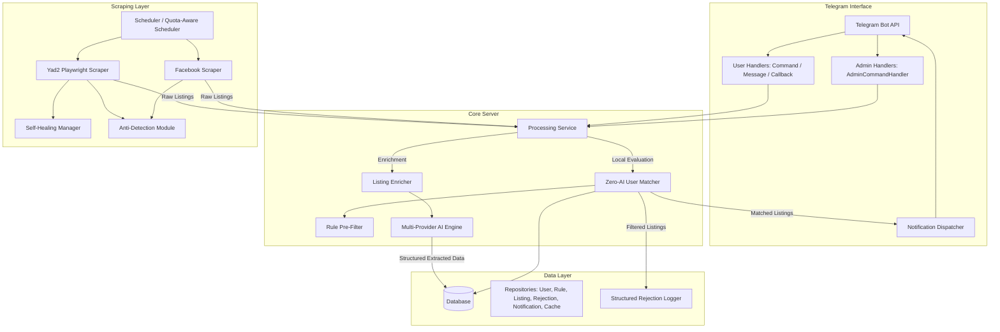

# 🔧 Technical Implementation Guide - Apartment Search Bot

## Architecture Overview



---

## Technology Stack

| Component | Technology | Purpose |
|-----------|------------|---------|
| **Language** | Python 3.11+ | Core development |
| **Bot Framework** | python-telegram-bot (>=21.0) | Telegram integration |
| **AI Engines** | Google Gemini 3.1 Flash / Groq / OpenAI / Anthropic | Listing enrichment, welcome/sass parsing, self-healing selector fixes |
| **Database** | SQLite (via aiosqlite / sqlalchemy) | User configuration, search rules, enriched listings, seen history, and rejection logs |
| **Scraping** | Playwright (>=1.40.0) | Headed/headless browser automation bypassing bot protection |
| **Scheduling** | APScheduler (>=3.10.0) | Periodic scraping cycles staggering Facebook and Yad2 |
| **Anti-Detection** | Custom anti-detection scripts & undetected-chromedriver | Bypassing scraping protection layers |

---

## Project Structure

* [main.py](file:///c:/Users/noamp/Downloads/apartmentsBot/main.py) - Wires database, AI engines, scrapers, and bot together, initializes tasks and handles shutdown.
* [config.py](file:///c:/Users/noamp/Downloads/apartmentsBot/config.py) - Manages application settings loaded from environment variables using `pydantic-settings`.
* [requirements.txt](file:///c:/Users/noamp/Downloads/apartmentsBot/requirements.txt) - List of exact application dependencies.
* **`bot/`**
  - [telegram_bot.py](file:///c:/Users/noamp/Downloads/apartmentsBot/bot/telegram_bot.py) - Main bot entry point that builds the Application, registers handlers, and updates Telegram menu commands.
  - **`handlers/`**
    - [command_handler.py](file:///c:/Users/noamp/Downloads/apartmentsBot/bot/handlers/command_handler.py) - User command handlers (`/start`, `/help`, `/rules`, `/toggle_bordering`, `/toggle_roomies`, `/rejections`, `/clear`, `/status`, `/matches`, `/sass`, `/persona`).
    - [admin_command_handler.py](file:///c:/Users/noamp/Downloads/apartmentsBot/bot/handlers/admin_command_handler.py) - Administrator-specific controls (dashboard statistics, logs, triggers, broadcasts, interactive browser login screenshots).
    - [message_handler.py](file:///c:/Users/noamp/Downloads/apartmentsBot/bot/handlers/message_handler.py) - Natural language parser that formats user requests into search rules.
    - [callback_handler.py](file:///c:/Users/noamp/Downloads/apartmentsBot/bot/handlers/callback_handler.py) - Handles button callbacks (e.g., persona selection buttons, onboarding).
    - [onboarding_handler.py](file:///c:/Users/noamp/Downloads/apartmentsBot/bot/handlers/onboarding_handler.py) - Logic for step-by-step onboarding flow for new users.
    - [decorators.py](file:///c:/Users/noamp/Downloads/apartmentsBot/bot/handlers/decorators.py) - Access control decorators (e.g., admin authentication check).
    - [bot_utils.py](file:///c:/Users/noamp/Downloads/apartmentsBot/bot/handlers/bot_utils.py) - Escape logic and safe replies handling markdown V2 format issues.
  - **`formatters/`**
    - [listing_formatter.py](file:///c:/Users/noamp/Downloads/apartmentsBot/bot/formatters/listing_formatter.py) - Formats apartment listings and coordinates for Telegram posts in Hebrew.
  - **`notifications/`**
    - [dispatcher.py](file:///c:/Users/noamp/Downloads/apartmentsBot/bot/notifications/dispatcher.py) - Delivery manager dispatcher for sending matched alerts.
* **`core/`**
  - [processing.py](file:///c:/Users/noamp/Downloads/apartmentsBot/core/processing.py) - Orchestrates matching, first-time notification check, blocking check, and notification execution.
  - [matcher.py](file:///c:/Users/noamp/Downloads/apartmentsBot/core/matcher.py) - Local Python rules checking and pre-filtering (Zero-AI User Matcher).
  - [ai_engine.py](file:///c:/Users/noamp/Downloads/apartmentsBot/core/ai_engine.py) - AI Engine wrapper interfaces with backoff retries, multi-model rotation, prompt batching, and cache warming.
  - [personas.py](file:///c:/Users/noamp/Downloads/apartmentsBot/core/personas.py) - Defines AI bot personalities ("barakush", "yekke", "mom", "stoner") and their prompt guidelines.
* **`scrapers/`**
  - [base_scraper.py](file:///c:/Users/noamp/Downloads/apartmentsBot/scrapers/base_scraper.py) - Abstract scraper wrapper base.
  - [facebook_scraper.py](file:///c:/Users/noamp/Downloads/apartmentsBot/scrapers/facebook_scraper.py) - Session-aware parallel scraper for Facebook groups with staggered launch and abort coordination.
  - [yad2_playwright_scraper.py](file:///c:/Users/noamp/Downloads/apartmentsBot/scrapers/yad2_playwright_scraper.py) - Playwright client to query Yad2 feeds.
  - [anti_detection.py](file:///c:/Users/noamp/Downloads/apartmentsBot/scrapers/anti_detection.py) - Stealth configurations (browser profile, platform, connection spoofing).
  - [self_healing.py](file:///c:/Users/noamp/Downloads/apartmentsBot/scrapers/self_healing.py) - Captures HTML structure anomalies, resolves broken CSS/XPath selectors via LLM, and persists them.
  - [scheduler.py](file:///c:/Users/noamp/Downloads/apartmentsBot/scrapers/scheduler.py) - Periodic APScheduler driver with blackout hours validation and adaptive cycle intervals.
* **`models/`**
  - [user.py](file:///c:/Users/noamp/Downloads/apartmentsBot/models/user.py) - Telegram user state model.
  - [search_rule.py](file:///c:/Users/noamp/Downloads/apartmentsBot/models/search_rule.py) - Search rules state model.
  - [listing.py](file:///c:/Users/noamp/Downloads/apartmentsBot/models/listing.py) - Listing and Enriched Listing state models.
  - [rejection_log.py](file:///c:/Users/noamp/Downloads/apartmentsBot/models/rejection_log.py) - Model representing logs of skipped matching candidate listings.
  - [user_settings.py](file:///c:/Users/noamp/Downloads/apartmentsBot/models/user_settings.py) - User custom preferences.
* **`database/`**
  - [connection.py](file:///c:/Users/noamp/Downloads/apartmentsBot/database/connection.py) - SQLite connection manager setting WAL journal and schema migration checks.
  - **`repositories/`**
    - [user_repository.py](file:///c:/Users/noamp/Downloads/apartmentsBot/database/repositories/user_repository.py) - User database operations.
    - [rule_repository.py](file:///c:/Users/noamp/Downloads/apartmentsBot/database/repositories/rule_repository.py) - Rule configurations storage.
    - [listing_repository.py](file:///c:/Users/noamp/Downloads/apartmentsBot/database/repositories/listing_repository.py) - Enriched listing cache and seen history.
    - [rejection_repository.py](file:///c:/Users/noamp/Downloads/apartmentsBot/database/repositories/rejection_repository.py) - Rejections logs table driver.
    - [notification_repository.py](file:///c:/Users/noamp/Downloads/apartmentsBot/database/repositories/notification_repository.py) - Sent notifications tracking.
    - [cache_repository.py](file:///c:/Users/noamp/Downloads/apartmentsBot/database/repositories/cache_repository.py) - Persisted welcome/sass line generator cache.
* **`utils/`**
  - [logger.py](file:///c:/Users/noamp/Downloads/apartmentsBot/utils/logger.py) - Rotating file JSON logging with Hebrew console formatting.
  - [telemetry.py](file:///c:/Users/noamp/Downloads/apartmentsBot/utils/telemetry.py) - Live metrics counters tracking scraping duration, AI limits, and errors.
  - [hebrew_utils.py](file:///c:/Users/noamp/Downloads/apartmentsBot/utils/hebrew_utils.py) - Price, room count, relative date, and broker fee extraction.
  - [israeli_locations.py](file:///c:/Users/noamp/Downloads/apartmentsBot/utils/israeli_locations.py) - In-memory database mapping neighborhoods and cities.
  - [text_utils.py](file:///c:/Users/noamp/Downloads/apartmentsBot/utils/text_utils.py) - Markdown V2 escaping helper.
  - [validators.py](file:///c:/Users/noamp/Downloads/apartmentsBot/utils/validators.py) - General validation checks.

---

## Core Data Models

### 1. User Model
*Defined in [models/user.py](file:///c:/Users/noamp/Downloads/apartmentsBot/models/user.py)*

```python
@dataclass
class User:
    telegram_id: int
    chat_id: int
    username: Optional[str] = None
    created_at: datetime = field(default_factory=datetime.now)
    is_active: bool = True
    first_notified_at: Optional[datetime] = None  # When user first received a listing
    persona: str = "barakush"
    is_admin: bool = False
    onboarding_step: Optional[str] = None
    allow_bordering_neighborhoods: bool = True
    allow_roomies: bool = True

    @property
    def is_new_user(self) -> bool:
        """Check if user has never received notifications yet."""
        return self.first_notified_at is None
```

### 2. Search Rule Model
*Defined in [models/search_rule.py](file:///c:/Users/noamp/Downloads/apartmentsBot/models/search_rule.py)*

```python
class RuleType(Enum):
    # Hard rules (can be evaluated without AI)
    PRICE_MAX = "price_max"
    PRICE_MIN = "price_min"
    BEDROOMS_MIN = "bedrooms_min"
    BEDROOMS_MAX = "bedrooms_max"
    
    # Soft rules (require location database or keywords check)
    AREA = "area"
    BORDER_AREA = "border_area"  # Geographic border-based area (e.g. "west of Ayalon, north of Jaffa")
    CUSTOM = "custom"  # Catch-all for ANY user requirement

@dataclass
class SearchRule:
    id: Optional[int] = None
    user_id: int = 0
    rule_type: RuleType = RuleType.CUSTOM
    value: str = ""  # For CUSTOM: stores target keyword or original Hebrew text as-is
    original_text: str = ""  # User's exact words for context
    is_active: bool = True
    created_at: datetime = field(default_factory=datetime.now)
    
    @property
    def is_hard_rule(self) -> bool:
        """Check if this rule can be evaluated without AI."""
        return self.rule_type in {
            RuleType.PRICE_MAX,
            RuleType.PRICE_MIN,
            RuleType.BEDROOMS_MIN,
            RuleType.BEDROOMS_MAX,
        }
    
    @property
    def is_soft_rule(self) -> bool:
        """Check if this rule requires location database/keywords check."""
        return self.rule_type in {RuleType.AREA, RuleType.BORDER_AREA, RuleType.CUSTOM}
```

### 3. Listing Model
*Defined in [models/listing.py](file:///c:/Users/noamp/Downloads/apartmentsBot/models/listing.py)*

```python
@dataclass
class Listing:
    id: str  # Unique identifier (hash of URL + source)
    source: str  # "facebook" or "yad2"
    url: str
    title: str
    description: str
    location: str
    raw_text: str  # Original Hebrew text
    
    price: Optional[int] = None
    bedrooms: Optional[int] = None
    phone: Optional[str] = None  # Contact phone number
    author: Optional[str] = None  # Name of person posting
    images: List[str] = field(default_factory=list)
    posted_at: Optional[datetime] = None
    scraped_at: datetime = field(default_factory=datetime.now)
```

### 4. Enriched Listing Model
*Defined in [models/listing.py](file:///c:/Users/noamp/Downloads/apartmentsBot/models/listing.py)*

```python
@dataclass
class EnrichedListing:
    listing: Listing
    
    # AI-extracted structured data (computed ONCE, utilized for ALL users)
    extracted_price: Optional[int] = None
    extracted_bedrooms: Optional[int] = None
    extracted_location: str = ""
    extracted_neighborhood: str = ""
    extracted_street: str = ""
    has_broker_fee: bool = False  # True if listing mentions תיווך
    roomies: bool = False         # True if listing represents roommates listing
    attributes: Dict[str, Any] = field(default_factory=dict)  # {"has_parking": True, ...}
    area_matches: Dict[str, bool] = field(default_factory=dict)  # {"תל אביב": True}
    bordering_areas: Dict[str, str] = field(default_factory=dict)  # {"נווה צדק": "גובל בפלורנטין"}
    
    @property
    def effective_monthly_price(self) -> Optional[int]:
        """Calculate effective monthly price including amortized broker fee.
        If listing has תיווך (broker fee), adds 1/12 of monthly rent to the price.
        """
        if self.extracted_price is None:
            return None
        if self.has_broker_fee:
            broker_fee_monthly = self.extracted_price // 12
            return self.extracted_price + broker_fee_monthly
        return self.extracted_price
    
    @property
    def broker_fee_note(self) -> str:
        """Generate Hebrew explanation of the effective price."""
        if not self.has_broker_fee or self.extracted_price is None:
            return ""
        broker_monthly = self.extracted_price // 12
        effective = self.effective_monthly_price
        return f"💰 מחיר כולל תיווך מפורס: {effective:,}₪ (שכירות {self.extracted_price:,}₪ + {broker_monthly:,}₪/חודש דמי תיווך)"

    @property
    def display_price(self) -> str:
        """Format price for display, including broker note if applicable."""
        if self.extracted_price is None:
            return "לא צוין מחיר"
        if self.has_broker_fee:
            return f"{self.extracted_price:,}₪ (+ תיווך)"
        return f"{self.extracted_price:,}₪"
```

### 5. Rejection Log Model
*Defined in [models/rejection_log.py](file:///c:/Users/noamp/Downloads/apartmentsBot/models/rejection_log.py)*

```python
@dataclass
class RejectionLog:
    listing_id: str
    user_id: int
    rejected_rules: List[str]  # Which rules failed (e.g. "מחיר מקסימלי: 5000")
    reasons: List[str]         # Human-readable explanations in Hebrew
    listing_url: Optional[str] = None
    listing_price: Optional[int] = None
    listing_location: Optional[str] = None
    match_method: str = "rule"  # "rule", "roomies_filter", "benefit_of_doubt", etc.
    timestamp: datetime = field(default_factory=datetime.now)
```

---

## AI Engine & Multi-Provider Rotation

To ensure high availability and prevent rate-limiting halts under the Gemini Free Tier (which enforces a strict **10 requests per minute** and **500 requests per day** per model), the bot uses a multi-provider structure supporting model rotation, prompt batching, caching, and retries.

### Engine Interfaces
All model classes derive from `BaseAIEngine` defined in [core/ai_engine.py](file:///c:/Users/noamp/Downloads/apartmentsBot/core/ai_engine.py):
1. **`GeminiAIEngine`**: Core engine supporting **automatic model rotation** across a list of configured models (e.g., `gemini-3.1-flash-lite`, `gemini-3-flash-preview`, `gemini-2.0-flash-exp`, `gemini-1.5-flash`, etc.).
2. **`OpenAIEngine`**: Integration for OpenAI models (`gpt-4o-mini`, etc.).
3. **`AnthropicEngine`**: Integration for Anthropic models (`claude-3-haiku-20240307`, etc.).
4. **`GroqEngine`**: High-speed, rate-limit-conscious provider using open models (`llama-3.3-70b-versatile`, etc.).
5. **`OllamaEngine`**: Integration for self-hosted local models (`llama3.2`, etc.).

### Automatic Model Rotation Strategy
If an API call fails due to rate-limiting (`429 RESOURCE_EXHAUSTED` or `Quota exceeded`), `GeminiAIEngine` automatically marks the current model index as exhausted, rotates to the next model in the list, and transparently retries the query.

```python
# Simplified snippet of rotation logic in core/ai_engine.py
class GeminiAIEngine(BaseAIEngine):
    ...
    async def generate_content(self, prompt: str, ...) -> str:
        attempts_across_models = 0
        max_total_attempts = len(self.models) * 2
        
        while attempts_across_models < max_total_attempts:
            model_name = self.current_model
            limiter = self.limiters[model_name]
            try:
                await limiter.acquire()
                response = await retry_with_backoff(
                    self.client.models.generate_content,
                    model=model_name,
                    contents=contents,
                    max_retries=max_retries
                )
                return response.text or ""
            except RateLimitExceeded:
                self._rotate_model()
                attempts_across_models += 1
                continue
            except Exception as e:
                if "429" in str(e) or "RESOURCE_EXHAUSTED" in str(e):
                    # Mark local limiter as exhausted for the day
                    limiter.daily_count = limiter.daily_limit
                    self._rotate_model()
                    attempts_across_models += 1
                    await asyncio.sleep(1)
                    continue
                raise
```

### Prompt Batching (ListingEnricher)
Listing enrichment uses **prompt batching** (aggregating up to `AI_BATCH_SIZE` (default 30) listings inside a single LLM prompt) to reduce API consumption. It prompts the model to return a JSON array containing structured attributes:

```json
{
  "listings": [
    {
      "listing_num": 1,
      "is_real_estate": true,
      "price": 5500,
      "bedrooms": 2,
      "location": "תל אביב",
      "neighborhood": "פלורנטין",
      "street": "הרצל",
      "has_broker": false,
      "roomies": false,
      "attributes": {
        "has_parking": true,
        "has_balcony": false,
        "has_elevator": true,
        "has_ac": true,
        "floor_number": 3,
        "is_ground_floor": false,
        "is_high_floor": false,
        "is_renovated": true,
        "allows_pets": true,
        "suitable_for_roommates": true,
        "has_storage": false,
        "has_security": false,
        "near_public_transport": true,
        "near_beach": false,
        "is_furnished": false,
        "from_owner_direct": true
      },
      "all_mentioned_areas": ["תל אביב", "פלורנטין"],
      "posted_hours_ago": 2
    }
  ]
}
```

### Pre-generation Caching
To minimize live user interaction latency, the AI engine pre-warms a persistent database cache (`ai_cache` table) with randomized welcome sentences and personality-specific sass one-liners during off-peak scraper cycles.

> [!WARNING]
> **Semantic User Matching Cancelled**: The bot does **not** call the AI engine during rule evaluation. Dynamically checking rules against raw listings in real-time scales quadratically ($O(U \cdot L)$ calls) and rapidly exhausts API limits. Rule matching is 100% processed by the local Python Rules engine (`ZeroAIUserMatcher`). The method `BaseAIEngine.evaluate_custom_rules` is deprecated and immediately returns `True` as a benefit-of-the-doubt fallback.

---

## Zero-AI Matching Engine

The matching pipeline is managed in [core/processing.py](file:///c:/Users/noamp/Downloads/apartmentsBot/core/processing.py) and executed locally inside [core/matcher.py](file:///c:/Users/noamp/Downloads/apartmentsBot/core/matcher.py).

### 1. Rule Pre-Filtering (Hard Rules)
Before matching locations or keywords, listings are filtered using basic numeric checks:
* **PRICE_MAX / PRICE_MIN**: Evaluated against `effective_monthly_price`. 
* **STRICT VALIDATION**: If the listing price is missing entirely, the listing **fails** maximum/minimum rule checks to prevent sending overpriced rentals.
* **BEDROOMS_MIN / BEDROOMS_MAX**: Assessed against the extracted room count.

### 2. Zero-AI User Matcher (Soft & Custom Rules)
`ZeroAIUserMatcher` evaluates candidate listings using cached geolocation data and static attribute indexes:

```python
class ZeroAIUserMatcher:
    def __init__(self):
        self.pre_filter = RulePreFilter()
        self.location_db = get_location_db()
        self.keyword_to_attr = {
            "חניה": "has_parking",
            "מרפסת": "has_balcony",
            "מעלית": "has_elevator",
            "מזגן": "has_ac",
            "קומת קרקע": "is_ground_floor",
            "קומה גבוהה": "is_high_floor",
            "משופץ": "is_renovated",
            "חדש": "is_renovated",
            "חיות": "allows_pets",
            "כלב": "allows_pets",
            "שותפים": "suitable_for_roommates",
            "שותף": "roomies",
            "מחסן": "has_storage",
            "שומר": "has_security",
            "ים": "near_beach",
            "מרוהטת": "is_furnished",
            "בעלים": "from_owner_direct",
        }
```

* **Area Matches**: Checked as an **OR** group. If multiple area rules exist, a listing matching *any* of them passes. It looks up the listing against `location_db` aliases and bordering settings.
* **Border Area Rules**: Commas-separated list of target neighborhoods (`RuleType.BORDER_AREA`) checked strictly **without** bordering neighborhood extensions. If the neighborhood name is not identified (e.g. only "Tel Aviv" is present), it passes as a benefit of the doubt.
* **Custom Rules Evaluation**: Maps rule keywords to pre-computed attributes. If the custom rule contains Hebrew negation keywords (like "לא", "ללא", "בלי"), it checks if the attribute is `False`.
* **Fallback Benefit-of-the-Doubt**: If the custom rule contains an unrecognized keyword, the matcher returns `True` to prevent false negatives.

### 3. Core Processing Pipeline
Every scraper cycle, `ProcessingService` fetches active users, performs a bulk fetch of all search rules and sent listing IDs, and processes candidates:

```python
# Match execution loop
for enriched in candidates:
    is_match, reasons = self.matcher.evaluate_listing(
        enriched, 
        rules, 
        allow_bordering=user.allow_bordering_neighborhoods,
        allow_roomies=user.allow_roomies
    )
    if is_match:
        await self._notify_match(user.chat_id, enriched, ...)
        await notification_repo.mark_sent(user.telegram_id, enriched.listing.id)
    else:
        rejections_to_log.append({
            "listing_id": enriched.listing.id,
            "user_id": user.telegram_id,
            "failed_rules": reasons.failed_rules,
            "reasons": reasons,
            "listing_url": enriched.listing.url,
            "listing_price": enriched.extracted_price,
            "listing_location": actual_location,
            "match_method": "attribute"
        })
# Save rejections in a single transaction
await rejection_repo.log_many_rejections(rejections_to_log)
```

---

## Geographic Grounding System

Smart geographical containment is handled locally in [utils/israeli_locations.py](file:///c:/Users/noamp/Downloads/apartmentsBot/utils/israeli_locations.py) without LLM overhead.

### Geographic Database
`IsraeliLocationDatabase` defines:
1. **City Aliases**: Mappings of common Hebrew spellings and abbreviations (e.g. `"תל אביב"` maps to `["תל-אביב", "ת\"א", "תא", "tel aviv"]`).
2. **Neighborhood Hierarchies**: Tel Aviv neighborhood mappings containing bordering names, aliases, and zone definitions (e.g., `פלורנטין` borders `["נווה צדק", "שפירא", "מונטיפיורי", "לב העיר", "נחלת בנימין"]`).
3. **Area Groupings**: General macro-areas (e.g. `"צפון תל אביב"`, `"דרום תל אביב"`, `"גוש דן"`, `"השרון"`).

### Match Resolution Flow (`is_location_match`)
When evaluating a listing against rules, the matching engine extracts a composite location string (e.g., combining street, neighborhood, and city) and resolves matching through 5 stages:

```
                  [Location Match Evaluation]
                              │
               (Stage 1: Neighborhood Check)
            Is listing neighborhood equal to target?
                    ├── Yes ──> [Match: Exact]
                    └── No
                              │
                  (Stage 2: City Check)
         Is target a city and listing in that city?
                    ├── Yes ──> [Match: Contains]
                    └── No
                              │
               (Stage 3: Bordering Check)
        Is allow_bordering True AND do they border?
                    ├── Yes ──> [Match: Bordering]
                    └── No
                              │
              (Stage 4: Area Group Check)
       Does listing city match macro area group list?
                    ├── Yes ──> [Match: Area Group]
                    └── No
                              │
            (Stage 5: Containment Fallback)
         Does listing city match target city (but
              neighborhood is not specified)?
                    ├── Yes ──> [Match: Contains]
                    └── No ──> [No Match]
```

---

## Database Schema & Storage Configuration

The bot uses SQLite 3. Since there are concurrent processes (periodic Playwright scrapers writing data, users updating rules via Telegram, and matching routines reading active configs), the database in [database/connection.py](file:///c:/Users/noamp/Downloads/apartmentsBot/database/connection.py) is optimized to use **WAL (Write-Ahead Logging)** mode.

### Database Performance Pragmas
```sql
PRAGMA journal_mode=WAL;
PRAGMA synchronous=NORMAL;
PRAGMA busy_timeout=10000;
PRAGMA foreign_keys=ON;
```

### Table Schema Mappings
```sql
-- Users table
CREATE TABLE IF NOT EXISTS users (
    telegram_id INTEGER PRIMARY KEY,
    chat_id INTEGER NOT NULL,
    username TEXT,
    created_at TIMESTAMP DEFAULT CURRENT_TIMESTAMP,
    is_active BOOLEAN DEFAULT TRUE,
    first_notified_at TIMESTAMP,
    persona TEXT DEFAULT 'barakush',
    is_admin BOOLEAN DEFAULT FALSE,
    onboarding_step TEXT DEFAULT NULL,
    allow_bordering_neighborhoods BOOLEAN DEFAULT TRUE,
    allow_roomies BOOLEAN DEFAULT TRUE
);

-- Search rules table
CREATE TABLE IF NOT EXISTS search_rules (
    id INTEGER PRIMARY KEY AUTOINCREMENT,
    user_id INTEGER NOT NULL,
    rule_type TEXT NOT NULL,
    value TEXT NOT NULL,
    original_text TEXT,
    is_active BOOLEAN DEFAULT TRUE,
    created_at TIMESTAMP DEFAULT CURRENT_TIMESTAMP,
    FOREIGN KEY (user_id) REFERENCES users(telegram_id) ON DELETE CASCADE
);

-- Seen listings (for deduplication)
CREATE TABLE IF NOT EXISTS seen_listings (
    listing_id TEXT PRIMARY KEY,
    source TEXT NOT NULL,
    url TEXT NOT NULL,
    first_seen_at TIMESTAMP DEFAULT CURRENT_TIMESTAMP
);

-- Cached enriched listings
CREATE TABLE IF NOT EXISTS enriched_listings (
    listing_id TEXT PRIMARY KEY,
    source TEXT NOT NULL,
    url TEXT NOT NULL,
    title TEXT,
    description TEXT,
    location TEXT,
    raw_text TEXT,
    images TEXT,  -- JSON array of image URLs
    extracted_price INTEGER,
    extracted_bedrooms INTEGER,
    extracted_location TEXT,
    extracted_neighborhood TEXT,
    has_broker_fee BOOLEAN DEFAULT FALSE,
    roomies BOOLEAN DEFAULT FALSE,
    attributes TEXT,  -- JSON representation of features
    area_matches TEXT,  -- JSON array
    bordering_areas TEXT,  -- JSON array
    posted_at TIMESTAMP,
    scraped_at TIMESTAMP,
    enriched_at TIMESTAMP DEFAULT CURRENT_TIMESTAMP
);

-- Rejection logs
CREATE TABLE IF NOT EXISTS rejection_logs (
    id INTEGER PRIMARY KEY AUTOINCREMENT,
    listing_id TEXT NOT NULL,
    user_id INTEGER NOT NULL,
    listing_url TEXT,
    listing_price INTEGER,
    listing_location TEXT,
    failed_rules TEXT NOT NULL,  -- JSON array of failed search constraints
    reasons TEXT NOT NULL,       -- JSON array of Hebrew explanations
    match_method TEXT,           -- "rule", "roomies_filter", etc.
    created_at TIMESTAMP DEFAULT CURRENT_TIMESTAMP,
    FOREIGN KEY (user_id) REFERENCES users(telegram_id) ON DELETE CASCADE
);

-- AI Cache for pre-generated lines
CREATE TABLE IF NOT EXISTS ai_cache (
    id INTEGER PRIMARY KEY AUTOINCREMENT,
    cache_type TEXT NOT NULL,  -- 'welcome' or 'sass'
    persona TEXT NOT NULL DEFAULT 'barakush',
    content TEXT NOT NULL,
    created_at TIMESTAMP DEFAULT CURRENT_TIMESTAMP
);

-- Sent notifications tracking
CREATE TABLE IF NOT EXISTS sent_notifications (
    user_id INTEGER NOT NULL,
    listing_id TEXT NOT NULL,
    sent_at TIMESTAMP DEFAULT CURRENT_TIMESTAMP,
    PRIMARY KEY (user_id, listing_id),
    FOREIGN KEY (user_id) REFERENCES users(telegram_id) ON DELETE CASCADE
);

-- Listing fingerprints (cross-source duplicate checks)
CREATE TABLE IF NOT EXISTS listing_fingerprints (
    listing_id TEXT PRIMARY KEY,
    author TEXT,
    phone TEXT,
    price INTEGER,
    bedrooms INTEGER,
    street TEXT,
    neighborhood TEXT,
    source TEXT NOT NULL,
    created_at TIMESTAMP DEFAULT CURRENT_TIMESTAMP,
    FOREIGN KEY (listing_id) REFERENCES seen_listings(listing_id) ON DELETE CASCADE
);
```

### Data Access Repositories
The database operations are encapsulated in individual repository classes initialized with a `DatabaseManager` instance:
* **`UserRepository`**: Performs CRUD for users, onboarding steps, preference toggles, and block updates.
* **`RuleRepository`**: Manages search rule entries (creation, update, soft deletes via `is_active = FALSE`).
* **`ListingRepository`**: Stores enriched data cache and coordinates fingerprint lookups.
* **`SeenListingsRepository`**: Records unique listing IDs to skip already scraped entries.
* **`RejectionRepository`**: Logs match failures in batches (`log_many_rejections`) and supports cleaning historical entries.
* **`NotificationRepository`**: Audits sent alerts to prevent duplicate Telegram notifications.
* **`CacheRepository`**: Pops and pushes pre-generated welcome sentences and sass one-liners.

---

## Configuration & Scheduling

### Environment Settings Mappings
Settings are read from `.env` using [config.py](file:///c:/Users/noamp/Downloads/apartmentsBot/config.py):

| Variable Name | Type | Default | Purpose |
|---------------|------|---------|---------|
| `TELEGRAM_BOT_TOKEN` | `str` | *Required* | Authentication token for the Telegram Bot |
| `AI_PROVIDER` | `str` | `"gemini"` | Active provider (`gemini`, `openai`, `anthropic`, `ollama`, `groq`) |
| `GEMINI_API_KEY` | `str` | `""` | Gemini API key |
| `GEMINI_MODEL` | `str` | `"gemini-3.1-flash-lite..."` | Comma-separated rotation list of Gemini models |
| `DATABASE_URL` | `str` | `"sqlite:///data/apartments.db"` | SQLite connection URL |
| `SCRAPE_INTERVAL_MINUTES` | `int` | `60` | Scraping scheduler interval |
| `BLACKOUT_START_HOUR` | `int` | `23` | Start hour (e.g. 11 PM Israel Time) to pause scraper |
| `BLACKOUT_END_HOUR` | `int` | `7` | End hour (7 AM Israel Time) to resume scraper |
| `BLACKOUT_JITTER_MINUTES` | `int` | `30` | Random offset buffer applied to blackout window |
| `FACEBOOK_GROUP_URLS` | `str` | `""` | Comma-separated list of target Facebook groups |
| `FACEBOOK_EMAIL` | `str` | `""` | Login email for Facebook authentication |
| `FACEBOOK_PASSWORD` | `str` | `""` | Login password for Facebook authentication |
| `MAX_CONCURRENT_FB_PAGES` | `int` | `2` | Maximum concurrent Facebook browser pages/groups scraped in parallel |
| `PARALLEL_FB_STAGGER_MIN` | `float` | `3.0` | Minimum delay in seconds before launching next parallel Facebook scraper task |
| `PARALLEL_FB_STAGGER_MAX` | `float` | `8.0` | Maximum delay in seconds before launching next parallel Facebook scraper task |
| `FACEBOOK_SELF_HEALING_ENABLED` | `bool` | `True` | Dynamic selector fixes for DOM structure shifts |
| `HEADLESS_MODE` | `bool` | `False` | Run Playwright in headless mode (defaults to `False` for stealth) |

### Playwright Self-Healing Selectors
Web layouts (especially Facebook) frequently change class names and DOM paths, breaking scrapers.
To maintain scraper resilience, the bot uses `SelfHealingManager` defined in [scrapers/self_healing.py](file:///c:/Users/noamp/Downloads/apartmentsBot/scrapers/self_healing.py).
When a selector fails to find a critical element (like post wrapper or post text), it takes a screenshot, extracts the nearby HTML snippet, and calls the AI model (`SELF_HEALING_MODEL`) to find the updated CSS selector or XPath. This healed selector is automatically cached in `data/healed_selectors.json` for subsequent runs.

### Parallel Facebook Scraping & Staggered Launch
To process Facebook scraping faster without getting blocked as a bot:
1. **Staggered Concurrent Launch**: The groups are scraped concurrently using `asyncio.gather()`. A semaphore (`_page_semaphore`) limits the number of pages open simultaneously to `MAX_CONCURRENT_FB_PAGES`. The initiation of subsequent pages is staggered by a randomized delay between `PARALLEL_FB_STAGGER_MIN` and `PARALLEL_FB_STAGGER_MAX` seconds.
2. **Session Warming**: To avoid concurrent authentication flows, session state warming (and loading cookies/selectors) is locked to the first running scraper task. Subsequent parallel tasks wait and inherit this initialized browser context directly.
3. **Abortion on Checkpoint**: If any concurrent scraper encounters a login required / verification checkpoint, it triggers a global abort event (`_abort_event`). Other parallel tasks check this signal during scroll operations and terminate gracefully immediately to prevent sending suspicious concurrent traffic to block pages.
4. **Group-Prefixed Logging**: Logs are automatically prefixed with the group label (extracted from the URL, e.g. `[group-name]`) to provide clear execution trace.

### Blackout and Adaptive Interval Scheduling
The scheduling system runs inside [scrapers/scheduler.py](file:///c:/Users/noamp/Downloads/apartmentsBot/scrapers/scheduler.py):
1. **Blackout Window Check**: Before running a scrape cycle, it verifies Israel time boundaries (`BLACKOUT_START_HOUR` to `BLACKOUT_END_HOUR`). To prevent detection, a random jitter offset (`-BLACKOUT_JITTER_MINUTES` to `+BLACKOUT_JITTER_MINUTES`) is calculated daily.
2. **`QuotaAwareScheduler`**: Dynamically calculates next execution intervals based on remaining daily API limits:
   - If remaining calls are high, it runs at the default interval (5-15 minutes).
   - If remaining calls fall below `LOW_QUOTA_THRESHOLD`, it extends the interval to `LOW_QUOTA_INTERVAL` (30 minutes).
   - If remaining calls fall below `MIN_DAILY_REMAINING_QUOTA` (20), it halts execution until the daily resetting midnight passes.

---

## Logging & Telemetry Systems

### Hebrew JSON Logging Setup
The logging configurations are defined in [utils/logger.py](file:///c:/Users/noamp/Downloads/apartmentsBot/utils/logger.py).
* **Console Logger**: Formatted using `HebrewConsoleFormatter` displaying human-readable timestamps, colorized log levels, and raw Hebrew characters.
* **File Logger**: Formatted using `JSONFormatter` writing logs in structured JSON lines to `logs/app.log` (rotating 10MB, max 10 backups) and `logs/errors.log` (errors only, max 5 backups).

```json
{"timestamp":"2026-06-09T08:12:04.123Z","level":"INFO","logger":"apt_bot.scraper","message":"Scraped listings","module":"facebook_scraper","function":"scrape","line":65,"data":{"source":"facebook","listings_found":12,"duration_seconds":14.2}}
```

### Telemetry Performance Tracking
System performance metrics are tracked in [utils/telemetry.py](file:///c:/Users/noamp/Downloads/apartmentsBot/utils/telemetry.py) and stored in `logs/telemetry.json` detailing:
* **Scrapers**: Success counts and run durations per source.
* **AI Metrics**: API request counts, accumulated latency, server errors, and remaining quota.
* **Matching**: Totals of processed, matched, and rejected listings.
* **Errors Log**: Counter dictionary tracking occurrences per module class name.

---

## Deployment & Verification

### Checklist for Deployment
1. Set up a Python 3.11 virtual environment.
2. Install Chromium and dependencies via Playwright:
   ```bash
   playwright install chromium
   playwright install-deps
   ```
3. Create a `.env` configuration file using `.env.example` as a template.
4. Run migration setup script or start the bot to auto-create SQLite schema.
5. Create a systemd daemon file or use PM2 to manage the `python main.py` runner process.

### Testing Commands
* **Run Unit/Integration Tests**:
  ```bash
  pytest
  ```
* **Verify Specific Scrapers**:
  ```bash
  python tests/test_scraper.py
  python tests/test_yad2_scraper.py
  ```
* **Debug User Rejections**:
  ```bash
  python scripts/debug_rejections.py --user <telegram_id>
  ```
