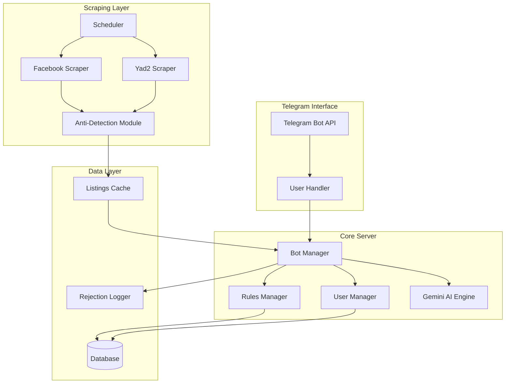
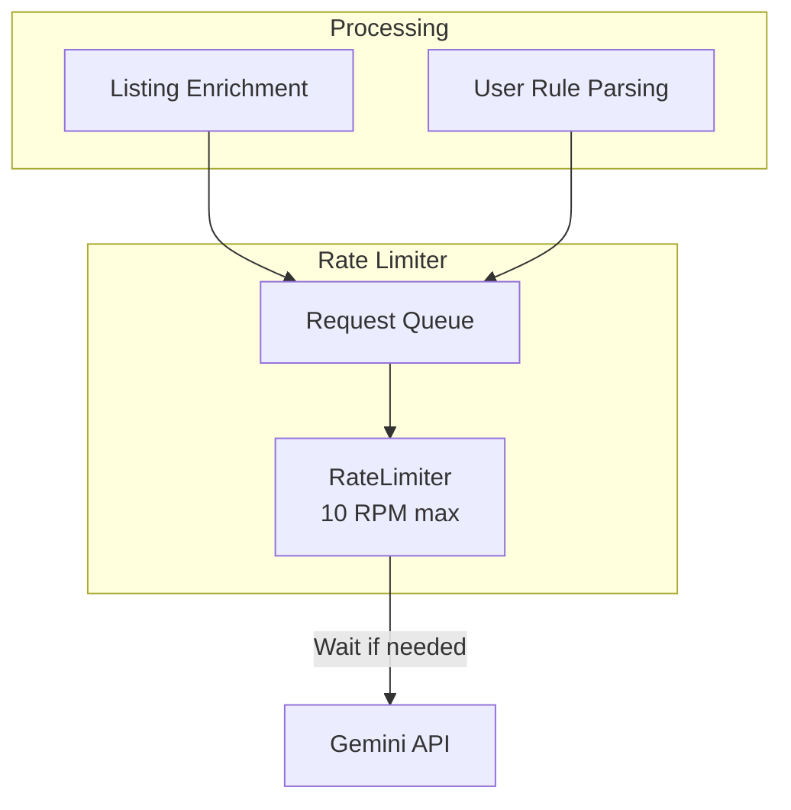
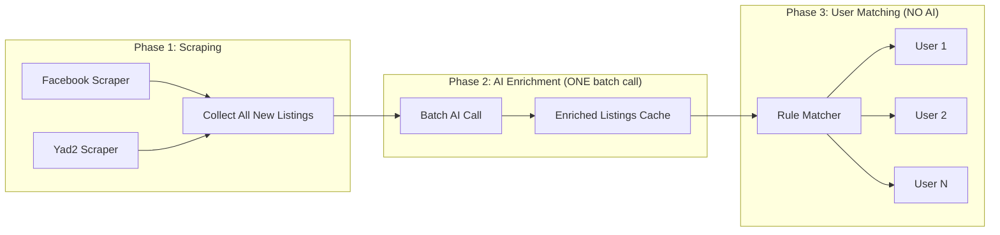
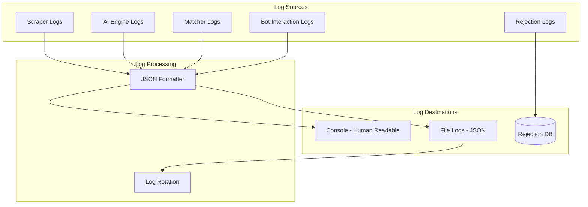

# 🔧 Technical Implementation Guide - Apartment Search Bot

## Architecture Overview



---

## Technology Stack

| Component | Technology | Purpose |
|-----------|------------|---------|
| **Language** | Python 3.11+ | Core development |
| **Bot Framework** | python-telegram-bot | Telegram integration |
| **AI Engine** | Google Gemini 3 Flash | NLP & rule matching |
| **Database** | SQLite / PostgreSQL | User & rule storage |
| **Scraping** | Playwright / Selenium | Browser automation |
| **Scheduling** | APScheduler | Periodic scraping |
| **Anti-Detection** | undetected-chromedriver | Bot evasion |

---

## Project Structure

```
apartment_bot/
├── main.py                     # Entry point
├── config.py                   # Configuration management
├── requirements.txt
│
├── bot/
│   ├── __init__.py
│   ├── telegram_bot.py         # Telegram bot handler
│   ├── handlers/
│   │   ├── __init__.py
│   │   ├── command_handler.py  # /start, /help, /rules
│   │   ├── message_handler.py  # Natural language processing
│   │   └── callback_handler.py # Inline button callbacks
│   └── formatters/
│       ├── __init__.py
│       └── listing_formatter.py # Format listings for Telegram
│
├── core/
│   ├── __init__.py
│   ├── user_manager.py         # User profile management
│   ├── rules_manager.py        # Search rules CRUD
│   ├── matcher.py              # Match listings to rules
│   └── ai_engine.py            # Gemini integration
│
├── scrapers/
│   ├── __init__.py
│   ├── base_scraper.py         # Abstract base class
│   ├── facebook_scraper.py     # Facebook groups scraper
│   ├── yad2_scraper.py         # Yad2 scraper
│   ├── anti_detection.py       # Bot evasion utilities
│   └── scheduler.py            # Scraping scheduler
│
├── models/
│   ├── __init__.py
│   ├── user.py                 # User model
│   ├── search_rule.py          # Rule model
│   ├── listing.py              # Apartment listing model
│   └── rejection_log.py        # Rejection tracking
│
├── database/
│   ├── __init__.py
│   ├── connection.py           # DB connection manager
│   └── repositories/
│       ├── __init__.py
│       ├── user_repository.py
│       ├── rule_repository.py
│       └── listing_repository.py
│
├── utils/
│   ├── __init__.py
│   ├── logger.py               # Logging configuration
│   ├── hebrew_utils.py         # Hebrew text processing
│   └── validators.py           # Input validation
│
└── tests/
    ├── __init__.py
    ├── test_scrapers/
    ├── test_matcher/
    └── test_bot/
```

---

## Core Classes

### 1. User Model

```python
from dataclasses import dataclass
from typing import List, Optional
from datetime import datetime

@dataclass
class User:
    telegram_id: int
    chat_id: int
    username: Optional[str]
    created_at: datetime
    is_active: bool = True
    search_rules: List['SearchRule'] = None
```

### 2. Search Rule Model

```python
from dataclasses import dataclass
from typing import Optional, List
from enum import Enum

class RuleType(Enum):
    # Hard rules (can be evaluated without AI)
    PRICE_MAX = "price_max"
    PRICE_MIN = "price_min"
    BEDROOMS_MIN = "bedrooms_min"
    BEDROOMS_MAX = "bedrooms_max"
    
    # Soft rules (require AI judgment)
    AREA = "area"
    CUSTOM = "custom"  # Catch-all for ANY user requirement

@dataclass
class SearchRule:
    id: int
    user_id: int
    rule_type: RuleType
    value: str  # For CUSTOM: stores the original Hebrew text as-is
    original_text: str  # User's exact words for context
    is_active: bool = True
    created_at: datetime = None
    
    # For custom rules, the AI interprets 'value' dynamically
    # No need to predefine categories - AI handles anything
```

### Custom Rules - Dynamic AI Interpretation

> [!IMPORTANT]
> Custom rules are **not hardcoded**. Users can state ANY requirement in natural Hebrew, and the AI evaluates listings against the user's intent.

```python
class CustomRuleEvaluator:
    """
    Evaluates any free-form custom rule using AI.
    No predefined categories - handles any requirement dynamically.
    """
    
    def __init__(self, ai_engine: 'GeminiAIEngine'):
        self.ai_engine = ai_engine
    
    def evaluate_custom_rules(
        self, 
        listing: 'Listing', 
        custom_rules: List['SearchRule']
    ) -> Tuple[bool, List[str]]:
        """
        Evaluate listing against user's custom requirements.
        
        The AI receives the user's original Hebrew text and decides
        if the listing satisfies the requirement.
        """
        if not custom_rules:
            return True, []
        
        # Build evaluation prompt with ALL custom rules
        rules_text = "\n".join([
            f"- {rule.original_text}" 
            for rule in custom_rules
        ])
        
        prompt = f"""
        בדוק אם הדירה עומדת בכל הדרישות המותאמות אישית.
        
        פרטי הדירה:
        כותרת: {listing.title}
        תיאור: {listing.description}
        מיקום: {listing.location}
        מחיר: {listing.price}
        חדרים: {listing.bedrooms}
        
        דרישות המשתמש:
        {rules_text}
        
        הנחיות:
        1. אם הדירה לא מזכירה משהו, הנח שזה לא קיים (אלא אם סביר להניח אחרת)
        2. השתמש בשיקול דעת - "קרוב לים" יכול להיות עד 10 דקות הליכה
        3. אם לא ברור, נטה לכלול את הדירה (עדיף false positive מ-false negative)
        
        החזר JSON:
        {{
            "passes_all": true/false,
            "evaluation": [
                {{
                    "rule": "הטקסט המקורי של הכלל",
                    "passes": true/false,
                    "reason": "הסבר קצר בעברית"
                }}
            ]
        }}
        """
        
        response = self.ai_engine.model.generate_content(prompt)
        result = self._parse_evaluation(response.text)
        
        failed = [
            f"{e['rule']}: {e['reason']}" 
            for e in result.get('evaluation', []) 
            if not e.get('passes', True)
        ]
        
        return result.get('passes_all', False), failed
    
    def suggest_rule_type(self, user_text: str) -> Tuple[RuleType, str]:
        """
        Attempt to classify user input, but default to CUSTOM if uncertain.
        This is for optimization only - unknown rules always work via CUSTOM.
        """
        prompt = f"""
        נתח את הכלל הבא ובדוק אם זה אחד מהסוגים המוכרים:
        - price_max / price_min (מחיר)
        - bedrooms_min / bedrooms_max (חדרים)
        - area (מיקום/שכונה)
        - custom (כל דבר אחר)
        
        טקסט: "{user_text}"
        
        החזר JSON:
        {{"type": "...", "extracted_value": "..."}}
        
        אם לא בטוח - החזר "custom" עם הטקסט המקורי.
        """
        
        response = self.ai_engine.model.generate_content(prompt)
        result = self._parse_json_response(response.text)
        
        type_map = {
            "price_max": RuleType.PRICE_MAX,
            "price_min": RuleType.PRICE_MIN,
            "bedrooms_min": RuleType.BEDROOMS_MIN,
            "bedrooms_max": RuleType.BEDROOMS_MAX,
            "area": RuleType.AREA,
            "custom": RuleType.CUSTOM
        }
        
        # Default to CUSTOM for anything unknown
        rule_type = type_map.get(result.get("type", "custom"), RuleType.CUSTOM)
        value = result.get("extracted_value", user_text)
        
        return rule_type, value
```

**Examples of dynamic rule handling:**

| User Says | AI Interpretation |
|-----------|------------------|
| "יש מקום לכלב גדול" | Checks if pets allowed, or yard/space mentioned |
| "לא רחוק מהעבודה בהרצליה" | Evaluates commute distance to Herzliya |
| "בניין עם שומר" | Looks for mentions of security/doorman |
| "מתאים לזוג צעיר" | Checks for quiet, size, amenities suitable for couple |
| "ללא שותפים קיימים" | Ensures listing is for empty apartment |


### 3. Listing Model

```python
@dataclass
class Listing:
    id: str  # Unique identifier (hash of URL + source)
    source: str  # "facebook" or "yad2"
    url: str
    title: str
    price: Optional[int]
    bedrooms: Optional[int]
    location: str
    description: str
    raw_text: str  # Original Hebrew text
    images: List[str]
    posted_at: datetime
    scraped_at: datetime
```

### 4. Rejection Log Model

```python
@dataclass
class RejectionLog:
    listing_id: str
    user_id: int
    rejected_rules: List[str]  # Which rules failed
    reasons: List[str]  # Human-readable explanations
    timestamp: datetime
```

---

## Key Implementation Details

### AI Engine (Gemini Integration)

```python
import google.generativeai as genai
from typing import Dict, List, Tuple

class GeminiAIEngine:
    """Handles all AI-powered operations using Gemini 2.5 Flash."""
    
    def __init__(self, api_key: str):
        genai.configure(api_key=api_key)
        self.model = genai.GenerativeModel('gemini-2.5-flash')
    
    def parse_user_rules(self, hebrew_text: str) -> List[Dict]:
        """
        Parse natural Hebrew text into structured rules.
        
        Example:
        Input: "אני מחפש דירה בתל אביב עד 5000 ש"ח, 3 חדרים"
        Output: [
            {"type": "area", "value": "תל אביב"},
            {"type": "price_max", "value": 5000},
            {"type": "bedrooms_min", "value": 3}
        ]
        """
        prompt = f"""
        נתח את הטקסט הבא וחלץ כללי חיפוש לדירה.
        החזר JSON עם מערך של כללים.
        
        טקסט: {hebrew_text}
        
        פורמט:
        [
            {{"type": "price_max|price_min|bedrooms_min|bedrooms_max|area|custom", "value": ...}}
        ]
        """
        response = self.model.generate_content(prompt)
        return self._parse_json_response(response.text)
    
    def evaluate_listing_match(
        self, 
        listing: 'Listing', 
        rules: List['SearchRule']
    ) -> Tuple[bool, List[str]]:
        """
        Evaluate if a listing matches user rules using AI judgment.
        Returns (is_match, list_of_failed_rules_with_reasons)
        """
        prompt = f"""
        בדוק אם הדירה הבאה תואמת לכללי החיפוש.
        
        דירה:
        מיקום: {listing.location}
        מחיר: {listing.price}
        חדרים: {listing.bedrooms}
        תיאור: {listing.description}
        
        כללים:
        {self._format_rules(rules)}
        
        החזר JSON:
        {{
            "is_match": true/false,
            "failed_rules": [
                {{"rule": "...", "reason": "..."}}
            ]
        }}
        """
        response = self.model.generate_content(prompt)
        return self._parse_match_response(response.text)
    
    def determine_area_match(
        self, 
        listing_location: str, 
        target_area: str,
        allow_bordering: bool = True
    ) -> Tuple[bool, bool, str]:
        """
        Use AI to determine if location matches area requirement.
        Supports neighborhood-level matching with optional bordering flexibility.
        
        Returns:
            Tuple of (is_match, is_bordering, explanation)
            - is_match: True if exact match or accepted bordering area
            - is_bordering: True if listing is in a bordering neighborhood
            - explanation: Hebrew explanation of the match decision
        """
        prompt = f"""
        בדוק אם המיקום "{listing_location}" מתאים לחיפוש באזור/שכונה "{target_area}".
        
        1. האם זה התאמה מדויקת לאזור/שכונה המבוקשת?
        2. אם לא, האם זו שכונה גובלת/סמוכה שעשויה לעניין?
        
        החזר JSON:
        {{
            "exact_match": true/false,
            "is_bordering": true/false,
            "bordering_explanation": "הסבר קצר אם שכונה גובלת",
            "recommendation": "כלול" או "דלג"
        }}
        """
        response = self.model.generate_content(prompt)
        result = self._parse_json_response(response.text)
        
        is_exact = result.get("exact_match", False)
        is_bordering = result.get("is_bordering", False)
        explanation = result.get("bordering_explanation", "")
        
        # Include if exact match, or if bordering and allowed
        is_match = is_exact or (allow_bordering and is_bordering)
        
        return is_match, is_bordering, explanation
```

## AI Call Optimization - Gemini Free Tier

> [!CAUTION]
> **Gemini Free Tier Limits (as of Dec 2024):**
> - **Gemini 2.5 Flash**: 10 requests per minute (RPM), ~1,500 requests per day
> - Rate limits are per PROJECT, not per API key
> - Exceeding limits returns 429 errors and may cause temporary blocks

### Rate Limit Strategy



### Core Rate Limiter

```python
import asyncio
from datetime import datetime, timedelta
from collections import deque
from typing import Any, Callable
import logging

logger = logging.getLogger(__name__)

class GeminiRateLimiter:
    """
    Rate limiter for Gemini free tier.
    Enforces 10 RPM with request queuing.
    """
    
    def __init__(
        self, 
        requests_per_minute: int = 10,
        daily_limit: int = 1500,
        safety_margin: float = 0.9  # Use only 90% of limit for safety
    ):
        self.rpm_limit = int(requests_per_minute * safety_margin)  # 9 RPM effective
        self.daily_limit = int(daily_limit * safety_margin)  # 1350 effective
        
        self.request_times: deque = deque(maxlen=self.rpm_limit)
        self.daily_count = 0
        self.daily_reset: datetime = self._next_midnight()
        
        self._lock = asyncio.Lock()
    
    def _next_midnight(self) -> datetime:
        """Calculate next midnight for daily reset."""
        now = datetime.now()
        return (now + timedelta(days=1)).replace(hour=0, minute=0, second=0, microsecond=0)
    
    async def acquire(self) -> bool:
        """
        Acquire permission to make an API call.
        Blocks until rate limit allows, or raises if daily limit exceeded.
        """
        async with self._lock:
            # Check daily limit
            if datetime.now() >= self.daily_reset:
                self.daily_count = 0
                self.daily_reset = self._next_midnight()
            
            if self.daily_count >= self.daily_limit:
                logger.error("Daily API limit reached!")
                raise RateLimitExceeded("תקרת הבקשות היומית הושגה")
            
            # Check RPM limit
            now = datetime.now()
            
            if len(self.request_times) >= self.rpm_limit:
                oldest = self.request_times[0]
                wait_seconds = 60 - (now - oldest).total_seconds()
                
                if wait_seconds > 0:
                    logger.info(f"Rate limit: waiting {wait_seconds:.1f}s")
                    await asyncio.sleep(wait_seconds)
            
            # Record this request
            self.request_times.append(datetime.now())
            self.daily_count += 1
            
            return True
    
    def get_remaining_quota(self) -> dict:
        """Get remaining API quota for monitoring."""
        return {
            "rpm_used": len(self.request_times),
            "rpm_limit": self.rpm_limit,
            "daily_used": self.daily_count,
            "daily_limit": self.daily_limit,
            "daily_remaining": self.daily_limit - self.daily_count
        }


class RateLimitExceeded(Exception):
    """Raised when API quota is exhausted."""
    pass
```

### Rate-Limited AI Engine

```python
class GeminiAIEngine:
    """Gemini AI engine with built-in rate limiting."""
    
    def __init__(self, api_key: str, rate_limiter: GeminiRateLimiter = None):
        genai.configure(api_key=api_key)
        self.model = genai.GenerativeModel('gemini-2.5-flash')
        self.rate_limiter = rate_limiter or GeminiRateLimiter()
    
    async def generate_content(self, prompt: str, max_retries: int = 3) -> str:
        """
        Generate content with rate limiting and retry logic.
        """
        for attempt in range(max_retries):
            try:
                # Wait for rate limit
                await self.rate_limiter.acquire()
                
                # Make API call
                response = await self.model.generate_content_async(prompt)
                return response.text
                
            except Exception as e:
                if "429" in str(e) or "RESOURCE_EXHAUSTED" in str(e):
                    # Rate limited by API - wait and retry
                    wait_time = 60 * (attempt + 1)  # Exponential backoff
                    logger.warning(f"API rate limited, waiting {wait_time}s...")
                    await asyncio.sleep(wait_time)
                else:
                    raise
        
        raise Exception("Max retries exceeded for Gemini API")
```

### Quota-Aware Processing Scheduler

```python
class QuotaAwareScheduler:
    """
    Schedules scraping cycles based on available API quota.
    Adjusts frequency to stay within free tier limits.
    """
    
    def __init__(
        self, 
        rate_limiter: GeminiRateLimiter,
        processor: 'ListingProcessor',
        target_cycles_per_day: int = 200  # ~1 cycle per 7 minutes
    ):
        self.rate_limiter = rate_limiter
        self.processor = processor
        
        # Calculate calls per cycle budget
        # 1500 daily / 200 cycles = ~7 calls per cycle
        self.calls_per_cycle_budget = (
            rate_limiter.daily_limit // target_cycles_per_day
        )
    
    async def run_adaptive_cycle(self):
        """
        Run a processing cycle that adapts to remaining quota.
        """
        quota = self.rate_limiter.get_remaining_quota()
        
        # If less than 10% daily quota remains, skip non-essential processing
        if quota["daily_remaining"] < self.rate_limiter.daily_limit * 0.1:
            logger.warning("Low quota - minimal processing only")
            await self.processor.run_minimal_cycle()
            return
        
        # Normal processing
        await self.processor.run_cycle(
            max_ai_calls=self.calls_per_cycle_budget
        )
    
    def calculate_optimal_interval(self) -> int:
        """
        Calculate optimal minutes between cycles based on quota.
        """
        quota = self.rate_limiter.get_remaining_quota()
        hours_remaining = (self.rate_limiter.daily_reset - datetime.now()).seconds / 3600
        
        if hours_remaining <= 0:
            return 5  # New day starting, normal interval
        
        # Distribute remaining quota across remaining hours
        calls_per_hour = quota["daily_remaining"] / hours_remaining
        cycles_per_hour = calls_per_hour / self.calls_per_cycle_budget
        
        minutes_between_cycles = max(5, int(60 / cycles_per_hour))
        
        return minutes_between_cycles
```

### Optimization Strategies (Free Tier Focused)

| Strategy | Description | Savings |
|----------|-------------|---------|
| **Rule-based Pre-filtering** | Filter obvious mismatches (price, rooms) before AI | 60-80% reduction |
| **Large Batch Processing** | Combine 10+ listings into single AI calls | 10x fewer calls |
| **Persistent Caching** | Cache area/attribute judgments to disk | 40-60% reduction |
| **Skip Duplicate Content** | Hash-based dedup before AI processing | 20-30% reduction |

### 1. Rule-Based Pre-Filtering (No AI Needed)

```python
class RulePreFilter:
    """Filter listings using deterministic rules BEFORE calling AI."""
    
    @staticmethod
    def passes_hard_rules(
        enriched: 'EnrichedListing', 
        rules: List['SearchRule']
    ) -> Tuple[bool, List[str]]:
        """
        Check rules that don't require AI judgment.
        Uses effective_monthly_price which includes amortized broker fee.
        Returns (passes, list_of_failed_rules)
        """
        failed_rules = []
        
        for rule in rules:
            if rule.rule_type == RuleType.PRICE_MAX:
                # Use effective price which includes broker fee if applicable
                effective_price = enriched.effective_monthly_price
                if effective_price and effective_price > int(rule.value):
                    if enriched.has_broker_fee:
                        failed_rules.append(
                            f"מחיר אפקטיבי {effective_price:,}₪ > מקסימום {int(rule.value):,}₪ "
                            f"(שכ\"ד {enriched.extracted_price:,}₪ + תיווך מפורס)"
                        )
                    else:
                        failed_rules.append(
                            f"מחיר {effective_price:,}₪ > מקסימום {int(rule.value):,}₪"
                        )
            
            elif rule.rule_type == RuleType.PRICE_MIN:
                # For min price, use base price (no broker fee consideration)
                price = enriched.extracted_price
                if price and price < int(rule.value):
                    failed_rules.append(f"מחיר {price:,}₪ < מינימום {int(rule.value):,}₪")
            
            elif rule.rule_type == RuleType.BEDROOMS_MIN:
                bedrooms = enriched.extracted_bedrooms
                if bedrooms and bedrooms < int(rule.value):
                    failed_rules.append(f"חדרים {bedrooms} < מינימום {rule.value}")
            
            elif rule.rule_type == RuleType.BEDROOMS_MAX:
                bedrooms = enriched.extracted_bedrooms
                if bedrooms and bedrooms > int(rule.value):
                    failed_rules.append(f"חדרים {listing.bedrooms} > מקסימום {rule.value}")
        
        return len(failed_rules) == 0, failed_rules
```

### 2. Area/Neighborhood Caching

```python
from functools import lru_cache
from typing import Dict
import hashlib

class AreaMatchCache:
    """Cache AI decisions about area/neighborhood matching."""
    
    def __init__(self, ai_engine: 'GeminiAIEngine'):
        self.ai_engine = ai_engine
        self._cache: Dict[str, Tuple[bool, bool, str]] = {}
    
    def _cache_key(self, location: str, target_area: str) -> str:
        """Generate consistent cache key for location pair."""
        normalized = f"{location.strip().lower()}|{target_area.strip().lower()}"
        return hashlib.md5(normalized.encode()).hexdigest()
    
    def get_area_match(
        self, 
        listing_location: str, 
        target_area: str,
        allow_bordering: bool = True
    ) -> Tuple[bool, bool, str]:
        """
        Get area match with caching.
        Cache persists for the session - same neighborhood pairs won't be re-evaluated.
        """
        cache_key = self._cache_key(listing_location, target_area)
        
        if cache_key in self._cache:
            cached = self._cache[cache_key]
            # Adjust is_match based on allow_bordering setting
            is_match = cached[0] if not cached[1] else (cached[0] and allow_bordering)
            return is_match, cached[1], cached[2]
        
        # Call AI only if not cached
        result = self.ai_engine.determine_area_match(
            listing_location, target_area, allow_bordering
        )
        self._cache[cache_key] = result
        return result
    
    def preload_common_areas(self, user_areas: List[str], known_neighborhoods: List[str]):
        """Pre-cache common area combinations during off-peak times."""
        for target in user_areas:
            for neighborhood in known_neighborhoods:
                self.get_area_match(neighborhood, target)
```

### 3. Optimized Processing Pipeline

> [!IMPORTANT]
> **Key principle**: Call AI **once per listing** during enrichment. User matching uses only the enriched data - **zero AI calls per user**.



---

## Israeli Location System

> [!IMPORTANT]
> Location matching requires understanding Israeli geography: city-neighborhood hierarchy, common name variations, and bordering relationships.

### Location Database

```python
# utils/israeli_locations.py
from dataclasses import dataclass
from typing import Dict, List, Set, Optional
import re

@dataclass
class Neighborhood:
    name: str
    city: str
    aliases: List[str]  # Alternative names/spellings
    bordering: List[str]  # Adjacent neighborhoods
    area_type: str  # "central", "north", "south", etc.

class IsraeliLocationDatabase:
    """
    Database of Israeli cities and neighborhoods with relationships.
    Used for smart location matching without AI calls.
    """
    
    def __init__(self):
        self._build_database()
    
    def _build_database(self):
        # City aliases (common variations)
        self.city_aliases: Dict[str, List[str]] = {
            "תל אביב": ["תל-אביב", "ת\"א", "תא", "תל אביב יפו", "תל-אביב-יפו", "tel aviv"],
            "ירושלים": ["י-ם", "ירושלים עיר", "jerusalem"],
            "חיפה": ["haifa"],
            "רמת גן": ["רמת-גן", "ר\"ג", "ramat gan"],
            "גבעתיים": ["גבעתים", "givatayim"],
            "הרצליה": ["herzliya"],
            "רעננה": ["raanana"],
            "פתח תקווה": ["פ\"ת", "פתח-תקווה", "petah tikva"],
            "ראשון לציון": ["ראשל\"צ", "ראשון-לציון", "rishon"],
            "הוד השרון": ["hod hasharon"],
            "כפר סבא": ["kfar saba"],
            "נתניה": ["netanya"],
            "באר שבע": ["ב\"ש", "beer sheva"],
        }
        
        # Tel Aviv neighborhoods - COMPREHENSIVE LIST
        self.tel_aviv_neighborhoods: Dict[str, Neighborhood] = {
            # === SOUTH TEL AVIV ===
            "פלורנטין": Neighborhood(
                name="פלורנטין", city="תל אביב",
                aliases=["florentin", "שכונת פלורנטין"],
                bordering=["נווה צדק", "שפירא", "מונטיפיורי", "לב העיר", "נחלת בנימין"],
                area_type="south"
            ),
            "נווה צדק": Neighborhood(
                name="נווה צדק", city="תל אביב",
                aliases=["neve tzedek", "נוה צדק", "neveh tzedek"],
                bordering=["פלורנטין", "לב העיר", "כרם התימנים", "יפו"],
                area_type="south"
            ),
            "שפירא": Neighborhood(
                name="שפירא", city="תל אביב",
                aliases=["shapira", "שכונת שפירא"],
                bordering=["פלורנטין", "התקווה", "נווה שאנן", "כפר שלם"],
                area_type="south"
            ),
            "התקווה": Neighborhood(
                name="התקווה", city="תל אביב",
                aliases=["שכונת התקווה", "hatikva", "hatikvah"],
                bordering=["שפירא", "יד אליהו", "כפר שלם", "עזרא"],
                area_type="south"
            ),
            "נווה שאנן": Neighborhood(
                name="נווה שאנן", city="תל אביב",
                aliases=["neve shaanan", "נוה שאנן", "שאנן נווה",],
                bordering=["שפירא", "התחנה המרכזית", "פלורנטין"],
                area_type="south"
            ),
            "כפר שלם": Neighborhood(
                name="כפר שלם", city="תל אביב",
                aliases=["kfar shalem"],
                bordering=["התקווה", "שפירא", "יד אליהו"],
                area_type="south"
            ),
            "עזרא": Neighborhood(
                name="עזרא", city="תל אביב",
                aliases=["ezra"],
                bordering=["התקווה", "יד אליהו"],
                area_type="south"
            ),
            
            # === JAFFA / יפו ===
            "יפו": Neighborhood(
                name="יפו", city="תל אביב",
                aliases=["jaffa", "yafo", "יפו העתיקה"],
                bordering=["נווה צדק", "עג'מי", "יפו ג'", "יפו ד'"],
                area_type="jaffa"
            ),
            "עג'מי": Neighborhood(
                name="עג'מי", city="תל אביב",
                aliases=["ajami", "עגמי"],
                bordering=["יפו", "יפו ג'", "בת ים"],
                area_type="jaffa"
            ),
            "יפו ג'": Neighborhood(
                name="יפו ג'", city="תל אביב",
                aliases=["jaffa c", "יפו ג"],
                bordering=["יפו", "עג'מי", "יפו ד'"],
                area_type="jaffa"
            ),
            "יפו ד'": Neighborhood(
                name="יפו ד'", city="תל אביב",
                aliases=["jaffa d", "יפו ד"],
                bordering=["יפו", "יפו ג'", "גבעת עלייה"],
                area_type="jaffa"
            ),
            "גבעת עלייה": Neighborhood(
                name="גבעת עלייה", city="תל אביב",
                aliases=["givat aliya"],
                bordering=["יפו ד'", "חולון"],
                area_type="jaffa"
            ),
            
            # === CENTRAL TEL AVIV ===
            "לב העיר": Neighborhood(
                name="לב העיר", city="תל אביב",
                aliases=["מרכז העיר", "center", "city center", "downtown"],
                bordering=["פלורנטין", "נווה צדק", "רוטשילד", "הבימה", "כרם התימנים", "מונטיפיורי", "נחלת בנימין"],
                area_type="central"
            ),
            "רוטשילד": Neighborhood(
                name="רוטשילד", city="תל אביב",
                aliases=["שדרות רוטשילד", "rothschild", "רוטשילד בולבארד"],
                bordering=["לב העיר", "נווה צדק", "הבימה", "אחוזת בית"],
                area_type="central"
            ),
            "הבימה": Neighborhood(
                name="הבימה", city="תל אביב",
                aliases=["כיכר הבימה", "habima", "ליד הבימה"],
                bordering=["רוטשילד", "לב העיר", "הצפון הישן", "כרם התימנים"],
                area_type="central"
            ),
            "כרם התימנים": Neighborhood(
                name="כרם התימנים", city="תל אביב",
                aliases=["kerem hateimanim", "כרם", "the kerem"],
                bordering=["נווה צדק", "לב העיר", "הבימה", "שוק הכרמל"],
                area_type="central"
            ),
            "מונטיפיורי": Neighborhood(
                name="מונטיפיורי", city="תל אביב",
                aliases=["montefiore", "מונטיפיורה"],
                bordering=["פלורנטין", "לב העיר", "נחלת בנימין"],
                area_type="central"
            ),
            "נחלת בנימין": Neighborhood(
                name="נחלת בנימין", city="תל אביב",
                aliases=["nachalat binyamin", "נחלת בנימן"],
                bordering=["לב העיר", "פלורנטין", "מונטיפיורי", "שוק הכרמל"],
                area_type="central"
            ),
            "אחוזת בית": Neighborhood(
                name="אחוזת בית", city="תל אביב",
                aliases=["ahuzat bait", "אחוזת-בית"],
                bordering=["רוטשילד", "לב העיר"],
                area_type="central"
            ),
            "שוק הכרמל": Neighborhood(
                name="שוק הכרמל", city="תל אביב",
                aliases=["carmel market", "הכרמל", "שוק הכרמל"],
                bordering=["כרם התימנים", "נחלת בנימין", "לב העיר"],
                area_type="central"
            ),
            "לב תל אביב": Neighborhood(
                name="לב תל אביב", city="תל אביב",
                aliases=["heart of tel aviv"],
                bordering=["לב העיר", "הבימה", "רוטשילד"],
                area_type="central"
            ),
            
            # === NORTH TEL AVIV ===
            "הצפון הישן": Neighborhood(
                name="הצפון הישן", city="תל אביב",
                aliases=["צפון ישן", "old north", "הצפון הישן תל אביב"],
                bordering=["הצפון החדש", "לב העיר", "הבימה", "בבלי"],
                area_type="north"
            ),
            "הצפון החדש": Neighborhood(
                name="הצפון החדש", city="תל אביב",
                aliases=["צפון חדש", "new north"],
                bordering=["הצפון הישן", "רמת אביב", "בבלי", "כוכב הצפון"],
                area_type="north"
            ),
            "בבלי": Neighborhood(
                name="בבלי", city="תל אביב",
                aliases=["bavli"],
                bordering=["הצפון הישן", "הצפון החדש", "קרית שאול"],
                area_type="north"
            ),
            "כוכב הצפון": Neighborhood(
                name="כוכב הצפון", city="תל אביב",
                aliases=["kochav hatzafon", "star of the north"],
                bordering=["הצפון החדש", "רמת אביב"],
                area_type="north"
            ),
            "רמת אביב": Neighborhood(
                name="רמת אביב", city="תל אביב",
                aliases=["ramat aviv"],
                bordering=["הצפון החדש", "רמת אביב ג'", "נווה אביבים", "כוכב הצפון"],
                area_type="north"
            ),
            "רמת אביב ג'": Neighborhood(
                name="רמת אביב ג'", city="תל אביב",
                aliases=["ramat aviv gimel", "רמת אביב ג"],
                bordering=["רמת אביב", "נווה אביבים", "אפקה"],
                area_type="north"
            ),
            "נווה אביבים": Neighborhood(
                name="נווה אביבים", city="תל אביב",
                aliases=["neve avivim", "נוה אביבים"],
                bordering=["רמת אביב", "רמת אביב ג'", "אפקה"],
                area_type="north"
            ),
            "אפקה": Neighborhood(
                name="אפקה", city="תל אביב",
                aliases=["afeka"],
                bordering=["רמת אביב ג'", "נווה אביבים", "רמת החייל"],
                area_type="north"
            ),
            "רמת החייל": Neighborhood(
                name="רמת החייל", city="תל אביב",
                aliases=["ramat hachayal", "רמת החיל"],
                bordering=["אפקה", "תל ברוך", "רמת גן"],
                area_type="north"
            ),
            "תל ברוך": Neighborhood(
                name="תל ברוך", city="תל אביב",
                aliases=["tel baruch"],
                bordering=["רמת החייל", "תל ברוך צפון"],
                area_type="north"
            ),
            "תל ברוך צפון": Neighborhood(
                name="תל ברוך צפון", city="תל אביב",
                aliases=["tel baruch north"],
                bordering=["תל ברוך", "הרצליה"],
                area_type="north"
            ),
            
            # === EAST TEL AVIV ===
            "יד אליהו": Neighborhood(
                name="יד אליהו", city="תל אביב",
                aliases=["yad eliyahu"],
                bordering=["התקווה", "עזרא", "נווה שרת", "הארגזים"],
                area_type="east"
            ),
            "נווה שרת": Neighborhood(
                name="נווה שרת", city="תל אביב",
                aliases=["neve sharet", "נוה שרת"],
                bordering=["יד אליהו", "קריית שלום", "גבעתיים"],
                area_type="east"
            ),
            "קריית שלום": Neighborhood(
                name="קריית שלום", city="תל אביב",
                aliases=["kiryat shalom"],
                bordering=["נווה שרת", "חולון"],
                area_type="east"
            ),
            "הארגזים": Neighborhood(
                name="הארגזים", city="תל אביב",
                aliases=["haargazim"],
                bordering=["יד אליהו"],
                area_type="east"
            ),
            "קרית שאול": Neighborhood(
                name="קרית שאול", city="תל אביב",
                aliases=["kiryat shaul", "קריית שאול"],
                bordering=["בבלי", "רמת גן"],
                area_type="east"
            ),
            
            # === BEACH / COAST ===
            "נמל תל אביב": Neighborhood(
                name="נמל תל אביב", city="תל אביב",
                aliases=["tel aviv port", "הנמל", "namal", "port"],
                bordering=["הצפון החדש", "הירקון"],
                area_type="coast"
            ),
            "הירקון": Neighborhood(
                name="הירקון", city="תל אביב",
                aliases=["hayarkon", "רחוב הירקון"],
                bordering=["נמל תל אביב", "הצפון הישן", "לב העיר"],
                area_type="coast"
            ),
            "גורדון": Neighborhood(
                name="גורדון", city="תל אביב",
                aliases=["gordon", "חוף גורדון"],
                bordering=["הירקון", "הצפון הישן"],
                area_type="coast"
            ),
            "פרישמן": Neighborhood(
                name="פרישמן", city="תל אביב",
                aliases=["frishman", "חוף פרישמן"],
                bordering=["גורדון", "לב העיר"],
                area_type="coast"
            ),
            "בוגרשוב": Neighborhood(
                name="בוגרשוב", city="תל אביב",
                aliases=["bogrshov", "בוגרשוב סנטר"],
                bordering=["פרישמן", "לב העיר"],
                area_type="coast"
            ),
            "בן יהודה": Neighborhood(
                name="בן יהודה", city="תל אביב",
                aliases=["ben yehuda", "רחוב בן יהודה"],
                bordering=["לב העיר", "בוגרשוב", "דיזנגוף"],
                area_type="central"
            ),
            "דיזנגוף": Neighborhood(
                name="דיזנגוף", city="תל אביב",
                aliases=["dizengoff", "כיכר דיזנגוף", "דיזינגוף"],
                bordering=["בן יהודה", "הצפון הישן", "לב העיר"],
                area_type="central"
            ),
            "אלנבי": Neighborhood(
                name="אלנבי", city="תל אביב",
                aliases=["allenby", "רחוב אלנבי"],
                bordering=["לב העיר", "נווה צדק", "כרם התימנים"],
                area_type="central"
            ),
        }
        
        # Area groupings (for "אזור" type searches)
        self.area_groups: Dict[str, List[str]] = {
            "גוש דן": ["תל אביב", "רמת גן", "גבעתיים", "בני ברק", "חולון", "בת ים", "אור יהודה", "קרית אונו"],
            "המרכז": ["תל אביב", "רמת גן", "גבעתיים", "הרצליה", "רעננה", "כפר סבא", "הוד השרון", "פתח תקווה", "ראשון לציון", "חולון", "בת ים"],
            "השרון": ["הרצליה", "רעננה", "כפר סבא", "הוד השרון", "נתניה", "רמת השרון"],
            
            # Tel Aviv sub-areas
            "צפון תל אביב": ["הצפון הישן", "הצפון החדש", "רמת אביב", "רמת אביב ג'", "אפקה", "נווה אביבים", "רמת החייל", "תל ברוך", "כוכב הצפון", "בבלי"],
            "דרום תל אביב": ["פלורנטין", "שפירא", "התקווה", "נווה שאנן", "כפר שלם", "עזרא"],
            "מרכז תל אביב": ["לב העיר", "רוטשילד", "הבימה", "כרם התימנים", "נווה צדק", "מונטיפיורי", "נחלת בנימין", "אחוזת בית", "שוק הכרמל", "דיזנגוף", "בן יהודה", "אלנבי"],
            "יפו": ["יפו", "עג'מי", "יפו ג'", "יפו ד'", "גבעת עלייה"],
            "קו החוף": ["נמל תל אביב", "הירקון", "גורדון", "פרישמן", "בוגרשוב"],
            "מזרח תל אביב": ["יד אליהו", "נווה שרת", "קריית שלום", "הארגזים", "קרית שאול"],
            "מרכז תל אביב": ["לב העיר", "רוטשילד", "הבימה", "כרם התימנים", "נווה צדק"],
        }
        
        # Build reverse lookup maps
        self._build_lookups()
    
    def _build_lookups(self):
        """Build efficient lookup structures."""
        # Neighborhood by any name
        self.neighborhood_lookup: Dict[str, Neighborhood] = {}
        for n in self.tel_aviv_neighborhoods.values():
            self.neighborhood_lookup[n.name.lower()] = n
            for alias in n.aliases:
                self.neighborhood_lookup[alias.lower()] = n
        
        # City by any name
        self.city_lookup: Dict[str, str] = {}
        for city, aliases in self.city_aliases.items():
            self.city_lookup[city.lower()] = city
            for alias in aliases:
                self.city_lookup[alias.lower()] = city
    
    def normalize_location(self, raw_location: str) -> dict:
        """
        Normalize a raw location string to structured data.
        Returns: {"city": str, "neighborhood": str, "normalized": str}
        """
        location = raw_location.strip().lower()
        
        # Try to find neighborhood
        neighborhood = None
        for name, n in self.neighborhood_lookup.items():
            if name in location:
                neighborhood = n
                break
        
        # Try to find city
        city = None
        for name, c in self.city_lookup.items():
            if name in location:
                city = c
                break
        
        # If neighborhood found but no city, use neighborhood's city
        if neighborhood and not city:
            city = neighborhood.city
        
        return {
            "city": city,
            "neighborhood": neighborhood.name if neighborhood else None,
            "normalized": f"{neighborhood.name if neighborhood else ''}, {city if city else raw_location}".strip(", ")
        }
    
    def is_location_match(
        self, 
        listing_location: str, 
        target_location: str,
        allow_bordering: bool = True
    ) -> Tuple[bool, str, str]:
        """
        Check if listing location matches target with smart logic.
        
        Returns: (is_match, match_type, explanation)
        match_type: "exact" | "contains" | "bordering" | "area_group" | "none"
        """
        listing_norm = self.normalize_location(listing_location)
        target_norm = self.normalize_location(target_location)
        
        listing_city = listing_norm["city"]
        listing_neighborhood = listing_norm["neighborhood"]
        target_city = target_norm["city"]
        target_neighborhood = target_norm["neighborhood"]
        
        # Case 1: Exact neighborhood match
        if target_neighborhood and listing_neighborhood:
            if target_neighborhood == listing_neighborhood:
                return True, "exact", f"התאמה מדויקת: {target_neighborhood}"
        
        # Case 2: Target is a city, listing is in that city
        if target_city and not target_neighborhood:
            if listing_city == target_city:
                return True, "contains", f"הדירה ב{listing_city}"
        
        # Case 3: Bordering neighborhoods
        if allow_bordering and target_neighborhood and listing_neighborhood:
            target_n = self.neighborhood_lookup.get(target_neighborhood.lower())
            if target_n and listing_neighborhood in target_n.bordering:
                return True, "bordering", f"{listing_neighborhood} גובל ב{target_neighborhood}"
        
        # Case 4: Area group match (e.g., "גוש דן", "המרכז")
        target_lower = target_location.lower()
        for group_name, cities in self.area_groups.items():
            if group_name in target_lower:
                if listing_city and listing_city in cities:
                    return True, "area_group", f"{listing_city} באזור {group_name}"
        
        # Case 5: Target is within listing area (reverse containment)
        # e.g., listing says "תל אביב" and target is "פלורנטין"
        if target_neighborhood and listing_city:
            target_n = self.neighborhood_lookup.get(target_neighborhood.lower())
            if target_n and target_n.city == listing_city:
                # Listing is in the right city but neighborhood not specified
                return True, "contains", f"הדירה ב{listing_city} (שכונה לא צוינה)"
        
        return False, "none", "מיקום לא תואם"
    
    def get_bordering_neighborhoods(self, neighborhood: str) -> List[str]:
        """Get list of neighborhoods that border the given one."""
        n = self.neighborhood_lookup.get(neighborhood.lower())
        return n.bordering if n else []
    
    def expand_area_search(self, target: str) -> List[str]:
        """
        Expand a search target to include all matching areas.
        Returns list of all acceptable neighborhoods/cities.
        """
        results = set()
        target_lower = target.lower()
        
        # Add exact match
        if target_lower in self.neighborhood_lookup:
            n = self.neighborhood_lookup[target_lower]
            results.add(n.name)
            results.update(n.bordering)
        
        if target_lower in self.city_lookup:
            city = self.city_lookup[target_lower]
            results.add(city)
            # Add all neighborhoods in that city
            for n in self.tel_aviv_neighborhoods.values():
                if n.city == city:
                    results.add(n.name)
        
        # Check area groups
        for group_name, cities in self.area_groups.items():
            if group_name in target_lower:
                results.update(cities)
        
        return list(results)
```

### Location Matching in Practice

| User Searches For | Listing Location | Match? | Reason |
|-------------------|-----------------|--------|--------|
| "פלורנטין" | "פלורנטין, תל אביב" | ✅ Exact | Exact neighborhood match |
| "פלורנטין" | "נווה צדק" | ✅ Bordering | נווה צדק borders פלורנטין |
| "תל אביב" | "רמת אביב" | ✅ Contains | רמת אביב is in תל אביב |
| "גוש דן" | "רמת גן" | ✅ Area Group | רמת גן is in גוש דן |
| "ת\"א" | "תל אביב יפו" | ✅ Alias | Same city, different spelling |
| "הרצליה" | "תל אביב" | ❌ None | Different cities |

```python
@dataclass
class EnrichedListing:
    """Listing with AI-extracted metadata. Created ONCE, used for ALL users."""
    
    # Original data
    listing: Listing
    
    # AI-extracted structured data (extracted ONCE)
    extracted_price: Optional[int] = None
    extracted_bedrooms: Optional[int] = None
    extracted_location: str = ""
    extracted_neighborhood: str = ""
    
    # Broker fee handling
    has_broker_fee: bool = False  # True if listing mentions תיווך
    
    # AI-computed attributes for custom rule matching
    attributes: Dict[str, Any] = None  # {"has_parking": True, "floor": 5, ...}
    
    # Pre-computed area matches (cached)
    area_matches: Dict[str, bool] = None  # {"תל אביב": True, "פלורנטין": True}
    bordering_areas: Dict[str, str] = None  # {"נווה צדק": "גובל בפלורנטין"}
    
    @property
    def effective_monthly_price(self) -> Optional[int]:
        """
        Calculate effective monthly price including amortized broker fee.
        
        If listing has תיווך (broker fee), adds 1/12 of monthly rent to the price.
        Standard broker fee in Israel is ~1 month rent, so we distribute it over 12 months.
        
        Example: 
            - Rent: 5000₪/month
            - With broker: 5000 + (5000/12) = 5000 + 417 = 5417₪/month effective
        """
        if self.extracted_price is None:
            return None
        
        if self.has_broker_fee:
            # Add amortized broker fee (1 month rent / 12 months)
            broker_fee_monthly = self.extracted_price // 12
            return self.extracted_price + broker_fee_monthly
        
        return self.extracted_price
    
    @property
    def broker_fee_note(self) -> str:
        """
        Generate Hebrew explanation of the effective price.
        Used in notifications to explain the price calculation.
        """
        if not self.has_broker_fee or self.extracted_price is None:
            return ""
        
        broker_monthly = self.extracted_price // 12
        effective = self.effective_monthly_price
        
        return f"💰 מחיר כולל תיווך מפורס: {effective:,}₪ (שכירות {self.extracted_price:,}₪ + {broker_monthly:,}₪/חודש דמי תיווך)"
```

> [!TIP]
> **Broker Fee Calculation**: When a listing has תיווך, the effective monthly cost is calculated as:
> `effective_price = rent + (rent / 12)`
> This helps users compare apples-to-apples when filtering by max price.


class ListingEnricher:
    """
    Enriches listings with AI-extracted data in a SINGLE batch call.
    This data is then used for ALL user matching without additional AI calls.
    """
    
    def __init__(self, ai_engine: 'GeminiAIEngine', batch_size: int = 10):
        self.ai_engine = ai_engine
        self.batch_size = batch_size
        self.common_attributes = [
            "has_parking", "has_balcony", "has_elevator", "has_ac",
            "floor_number", "is_ground_floor", "is_high_floor",
            "is_renovated", "is_new_building", "building_year",
            "allows_pets", "suitable_for_roommates", "has_storage",
            "has_security", "near_public_transport", "near_beach",
            "is_furnished", "from_owner_direct"
        ]
    
    async def enrich_listings(self, listings: List[Listing]) -> List[EnrichedListing]:
        """
        Enrich all listings in batches. ONE AI call per batch.
        Returns enriched listings ready for user matching.
        """
        all_enriched = []
        
        for i in range(0, len(listings), self.batch_size):
            batch = listings[i:i + self.batch_size]
            enriched_batch = await self._enrich_batch(batch)
            all_enriched.extend(enriched_batch)
        
        return all_enriched
    
    async def _enrich_batch(self, listings: List[Listing]) -> List[EnrichedListing]:
        """Single AI call to extract all data from a batch of listings."""
        
        listings_text = "\n\n---\n\n".join([
            f"דירה {i+1}:\n"
            f"כותרת: {l.title}\n"
            f"תיאור: {l.description}\n"
            f"מיקום גולמי: {l.location}"
            for i, l in enumerate(listings)
        ])
        
        prompt = f"""
        נתח את כל הדירות הבאות וחלץ מידע מובנה.
        
        {listings_text}
        
        עבור כל דירה החזר:
        {{
            "listing_num": 1,
            "price": מספר או null,
            "bedrooms": מספר או null,
            "location": "עיר",
            "neighborhood": "שכונה ספציפית אם מוזכרת",
            "attributes": {{
                "has_parking": true/false/null,
                "has_balcony": true/false/null,
                "has_elevator": true/false/null,
                "has_ac": true/false/null,
                "floor_number": מספר או null,
                "is_ground_floor": true/false/null,
                "is_high_floor": true/false/null,
                "is_renovated": true/false/null,
                "building_year": מספר או null,
                "allows_pets": true/false/null,
                "suitable_for_roommates": true/false/null,
                "has_storage": true/false/null,
                "has_security": true/false/null,
                "near_public_transport": true/false/null,
                "near_beach": true/false/null,
                "is_furnished": true/false/null,
                "from_owner_direct": true/false/null
            }},
            "all_mentioned_areas": ["תל אביב", "פלורנטין", ...],
            "bordering_neighborhoods": {{"שכונה": "שכונה גובלת"}}
        }}
        
        החזר JSON:
        {{"listings": [...]}}
        """
        
        response = await self.ai_engine.model.generate_content_async(prompt)
        parsed = self._parse_batch_enrichment(response.text)
        
        enriched = []
        for listing, data in zip(listings, parsed.get("listings", [])):
            enriched.append(EnrichedListing(
                listing=listing,
                extracted_price=data.get("price"),
                extracted_bedrooms=data.get("bedrooms"),
                extracted_location=data.get("location", ""),
                extracted_neighborhood=data.get("neighborhood", ""),
                attributes=data.get("attributes", {}),
                area_matches={area: True for area in data.get("all_mentioned_areas", [])},
                bordering_areas=data.get("bordering_neighborhoods", {})
            ))
        
        return enriched
```

### User Matching - Zero AI Calls

```python
class ZeroAIUserMatcher:
    """
    Matches enriched listings to users WITHOUT any AI calls.
    All matching is done against pre-computed enriched data.
    """
    
    def __init__(self, user_repository: 'UserRepository'):
        self.user_repository = user_repository
        self.pre_filter = RulePreFilter()
    
    async def match_all_users(
        self, 
        enriched_listings: List[EnrichedListing]
    ) -> Dict[int, List[EnrichedListing]]:
        """
        Match all listings to all users. NO AI CALLS.
        Returns dict of user_id -> matching listings
        """
        users = await self.user_repository.get_all_active_users()
        matches: Dict[int, List[EnrichedListing]] = {}
        
        for user in users:
            user_matches = []
            rules = await self.user_repository.get_user_rules(user.telegram_id)
            
            for enriched in enriched_listings:
                is_match, rejection_reasons = self._evaluate_listing(enriched, rules)
                
                if is_match:
                    user_matches.append(enriched)
                else:
                    await self._log_rejection(
                        enriched.listing, user.telegram_id, rejection_reasons
                    )
            
            if user_matches:
                matches[user.telegram_id] = user_matches
        
        return matches
    
    def _evaluate_listing(
        self, 
        enriched: EnrichedListing, 
        rules: List[SearchRule]
    ) -> Tuple[bool, List[str]]:
        """
        Evaluate a single enriched listing against user rules.
        Uses ONLY pre-computed data - no AI calls.
        """
        rejection_reasons = []
        
        for rule in rules:
            if rule.rule_type == RuleType.PRICE_MAX:
                if enriched.extracted_price and enriched.extracted_price > int(rule.value):
                    rejection_reasons.append(
                        f"מחיר {enriched.extracted_price} > מקסימום {rule.value}"
                    )
            
            elif rule.rule_type == RuleType.PRICE_MIN:
                if enriched.extracted_price and enriched.extracted_price < int(rule.value):
                    rejection_reasons.append(
                        f"מחיר {enriched.extracted_price} < מינימום {rule.value}"
                    )
            
            elif rule.rule_type == RuleType.BEDROOMS_MIN:
                if enriched.extracted_bedrooms and enriched.extracted_bedrooms < int(rule.value):
                    rejection_reasons.append(
                        f"חדרים {enriched.extracted_bedrooms} < מינימום {rule.value}"
                    )
            
            elif rule.rule_type == RuleType.BEDROOMS_MAX:
                if enriched.extracted_bedrooms and enriched.extracted_bedrooms > int(rule.value):
                    rejection_reasons.append(
                        f"חדרים {enriched.extracted_bedrooms} > מקסימום {rule.value}"
                    )
            
            elif rule.rule_type == RuleType.AREA:
                # Check pre-computed area matches
                target_area = rule.value.strip().lower()
                matched = any(
                    target_area in area.lower() 
                    for area in enriched.area_matches.keys()
                )
                # Also check bordering areas
                if not matched:
                    matched = any(
                        target_area in border.lower()
                        for border in enriched.bordering_areas.keys()
                    )
                if not matched:
                    rejection_reasons.append(
                        f"מיקום {enriched.extracted_location} לא תואם {rule.value}"
                    )
            
            elif rule.rule_type == RuleType.CUSTOM:
                # Match against pre-computed attributes
                match_result = self._match_custom_rule(enriched, rule)
                if not match_result[0]:
                    rejection_reasons.append(match_result[1])
        
        return len(rejection_reasons) == 0, rejection_reasons


class HybridSmartMatcher:
    """
    Hybrid matcher that preserves AI-quality matching while respecting rate limits.
    
    Strategy:
    1. First try to match using pre-computed attributes (fast, no AI)
    2. For unknown/complex rules, queue for AI evaluation (smart, budget-aware)
    3. Batch AI calls for efficiency
    """
    
    def __init__(
        self, 
        ai_engine: 'GeminiAIEngine',
        rate_limiter: 'GeminiRateLimiter',
        ai_calls_per_cycle_budget: int = 5
    ):
        self.ai_engine = ai_engine
        self.rate_limiter = rate_limiter
        self.ai_budget = ai_calls_per_cycle_budget
        self.ai_calls_used = 0
        
        # Known attribute mappings (fast path)
        self.keyword_to_attr = {
            "חניה": "has_parking",
            "מרפסת": "has_balcony",
            "מעלית": "has_elevator",
            "מזגן": "has_ac",
            "קומת קרקע": "is_ground_floor",
            "קומה גבוהה": "is_high_floor",
            "משופץ": "is_renovated",
            "חדש": "is_renovated",
            "חיות": "allows_pets",
            "כלב": "allows_pets",
            "חתול": "allows_pets",
            "שותפים": "suitable_for_roommates",
            "מחסן": "has_storage",
            "שומר": "has_security",
            "תחבורה": "near_public_transport",
            "אוטובוס": "near_public_transport",
            "רכבת": "near_public_transport",
            "ים": "near_beach",
            "מרוהטת": "is_furnished",
            "ריהוט": "is_furnished",
            "בעלים": "from_owner_direct",
            "תיווך": "from_owner_direct",
        }
    
    async def match_custom_rule(
        self, 
        enriched: EnrichedListing, 
        rule: SearchRule
    ) -> Tuple[bool, str, str]:
        """
        Smart matching with quality preservation.
        
        Returns: (is_match, rejection_reason, match_method)
        match_method: "attribute" | "ai" | "benefit_of_doubt"
        """
        rule_text = rule.value.lower()
        attrs = enriched.attributes or {}
        
        # STEP 1: Try attribute-based matching (known rules)
        matched_keyword = None
        for keyword, attr_name in self.keyword_to_attr.items():
            if keyword in rule_text:
                matched_keyword = keyword
                attr_value = attrs.get(attr_name)
                
                is_negation = any(neg in rule_text for neg in ["לא", "ללא", "בלי"])
                
                # Clear match from attributes
                if attr_value is not None:
                    if is_negation and attr_value is True:
                        return False, f"הדירה כוללת {keyword}", "attribute"
                    elif not is_negation and attr_value is False:
                        return False, f"הדירה לא כוללת {keyword}", "attribute"
                    elif is_negation and attr_value is False:
                        return True, "", "attribute"
                    elif not is_negation and attr_value is True:
                        return True, "", "attribute"
                # attr_value is None - need AI judgment
                break
        
        # STEP 2: Unknown rule or uncertain attribute - use AI if budget allows
        if self._can_use_ai():
            return await self._ai_evaluate_rule(enriched, rule)
        
        # STEP 3: No AI budget - apply smart defaults
        return self._apply_smart_default(enriched, rule, matched_keyword)
    
    def _can_use_ai(self) -> bool:
        """Check if we have AI budget remaining for this cycle."""
        if self.ai_calls_used >= self.ai_budget:
            return False
        
        # Also check rate limiter
        quota = self.rate_limiter.get_remaining_quota()
        return quota["daily_remaining"] > 50  # Keep buffer for essential calls
    
    async def _ai_evaluate_rule(
        self, 
        enriched: EnrichedListing, 
        rule: SearchRule
    ) -> Tuple[bool, str, str]:
        """
        Use AI for smart evaluation of complex/unknown rules.
        This preserves matching QUALITY for rules that can't be handled by attributes.
        """
        self.ai_calls_used += 1
        
        prompt = f"""
        בדוק אם הדירה הבאה עומדת בדרישה הספציפית.
        
        דרישת המשתמש: "{rule.original_text}"
        
        פרטי הדירה:
        כותרת: {enriched.listing.title}
        תיאור: {enriched.listing.description}
        מיקום: {enriched.extracted_location}
        שכונה: {enriched.extracted_neighborhood}
        מחיר: {enriched.extracted_price}
        חדרים: {enriched.extracted_bedrooms}
        
        מאפיינים ידועים:
        {self._format_known_attributes(enriched.attributes)}
        
        הנחיות:
        1. השתמש בשיקול דעת אנושי - מה היית אומר לחבר שמחפש דירה?
        2. אם המידע לא מספיק, אך הדירה נראית מתאימה - אשר
        3. רק דחה אם יש אינדיקציה ברורה שהדרישה לא מתקיימת
        
        החזר JSON:
        {{
            "matches": true/false,
            "confidence": "high/medium/low",
            "reason": "הסבר קצר בעברית"
        }}
        """
        
        try:
            response = await self.ai_engine.generate_content(prompt)
            result = self._parse_ai_response(response)
            
            if result.get("matches", True):
                return True, "", "ai"
            else:
                return False, result.get("reason", "לא עומד בדרישה"), "ai"
                
        except Exception as e:
            # AI failed - use benefit of doubt
            logger.warning(f"AI evaluation failed: {e}")
            return True, "", "benefit_of_doubt"
    
    def _apply_smart_default(
        self, 
        enriched: EnrichedListing, 
        rule: SearchRule,
        matched_keyword: str = None
    ) -> Tuple[bool, str, str]:
        """
        Smart defaults when AI budget is exhausted.
        Errs on side of inclusion to avoid missing good listings.
        
        Logic:
        - If listing description mentions something related to rule, include
        - If rule is about amenity not mentioned at all, include (might be there)
        - Only exclude if there's clear contradiction
        """
        rule_text = rule.value.lower()
        description = enriched.listing.description.lower()
        
        # Check for explicit contradiction in description
        negation_patterns = [
            ("חניה", ["אין חניה", "ללא חניה", "בלי חניה"]),
            ("מרפסת", ["אין מרפסת", "ללא מרפסת"]),
            ("מעלית", ["אין מעלית", "ללא מעלית", "בלי מעלית"]),
            ("חיות", ["ללא חיות", "לא מותר חיות", "אסור חיות"]),
        ]
        
        is_negation = any(neg in rule_text for neg in ["לא", "ללא", "בלי"])
        
        for feature, contradict_phrases in negation_patterns:
            if feature in rule_text:
                # User wants this feature
                if not is_negation:
                    # Check if listing explicitly says no
                    if any(phrase in description for phrase in contradict_phrases):
                        return False, f"הדירה מציינת במפורש ללא {feature}", "smart_default"
                # User doesn't want this feature
                else:
                    # Check if listing explicitly has it
                    if feature in description and not any(neg in description for neg in ["אין", "ללא", "בלי"]):
                        return False, f"הדירה כוללת {feature}", "smart_default"
        
        # No clear contradiction - include the listing
        return True, "", "benefit_of_doubt"
    
    def _format_known_attributes(self, attrs: dict) -> str:
        """Format known attributes for AI prompt."""
        if not attrs:
            return "לא ידועים"
        
        known = []
        attr_names_hebrew = {
            "has_parking": "חניה",
            "has_balcony": "מרפסת",
            "has_elevator": "מעלית",
            "has_ac": "מזגן",
            "is_ground_floor": "קומת קרקע",
            "is_high_floor": "קומה גבוהה",
            "is_renovated": "משופץ",
            "allows_pets": "מותר חיות",
            "suitable_for_roommates": "מתאים לשותפים",
            "has_storage": "מחסן",
            "has_security": "שומר",
            "near_public_transport": "קרוב לתחבורה",
            "near_beach": "קרוב לים",
            "is_furnished": "מרוהט",
            "from_owner_direct": "ישירות מבעלים",
        }
        
        for attr, value in attrs.items():
            if value is not None:
                hebrew = attr_names_hebrew.get(attr, attr)
                status = "כן" if value else "לא"
                known.append(f"{hebrew}: {status}")
        
        return ", ".join(known) if known else "לא ידועים"
    
    def reset_cycle_budget(self):
        """Reset AI budget for new processing cycle."""
        self.ai_calls_used = 0
```


### Complete Processing Flow

```python
class ListingProcessor:
    """
    Orchestrates the complete flow:
    1. Collect all new listings
    2. Enrich with ONE batch AI call
    3. Match to all users (NO AI)
    4. Send notifications
    """
    
    def __init__(
        self,
        facebook_scraper: 'FacebookScraper',
        yad2_scraper: 'Yad2Scraper',
        enricher: 'ListingEnricher',
        matcher: 'ZeroAIUserMatcher',
        notifier: 'TelegramNotifier',
        seen_repository: 'SeenListingsRepository'
    ):
        self.scrapers = [facebook_scraper, yad2_scraper]
        self.enricher = enricher
        self.matcher = matcher
        self.notifier = notifier
        self.seen_repository = seen_repository
    
    async def run_cycle(self):
        """
        Single processing cycle. Called every X minutes by scheduler.
        """
        # PHASE 1: Collect all new listings from all sources
        all_listings = []
        for scraper in self.scrapers:
            try:
                listings = await scraper.scrape()
                all_listings.extend(listings)
            except Exception as e:
                logger.error(f"Scraper {scraper.__class__.__name__} failed: {e}")
        
        # Filter out already-seen listings
        new_listings = await self._filter_new_listings(all_listings)
        
        if not new_listings:
            logger.info("No new listings found")
            return
        
        logger.info(f"Found {len(new_listings)} new listings")
        
        # PHASE 2: Enrich ALL listings with ONE batch AI call
        # This is the ONLY place AI is called
        enriched = await self.enricher.enrich_listings(new_listings)
        
        # Mark as seen
        await self.seen_repository.mark_as_seen(new_listings)
        
        # PHASE 3: Match to ALL users (NO AI calls here)
        user_matches = await self.matcher.match_all_users(enriched)
        
        # PHASE 4: Send notifications
        for user_id, matches in user_matches.items():
            for enriched_listing in matches:
                await self.notifier.send_listing(user_id, enriched_listing)
        
        logger.info(f"Sent {sum(len(m) for m in user_matches.values())} notifications")
```

### AI Call Summary - Free Tier Budget

```
┌─────────────────────────────────────────────────────────────────┐
│ GEMINI FREE TIER BUDGET (Gemini 2.5 Flash)                      │
├─────────────────────────────────────────────────────────────────┤
│ Rate Limit:     10 requests per minute (RPM)                    │
│ Daily Limit:    ~1,500 requests per day (with safety margin)    │
│ Effective:      9 RPM / 1,350 daily (after 10% safety buffer)   │
└─────────────────────────────────────────────────────────────────┘

Processing Cycle (20 users, 50 new listings):

PHASE 1 - Scraping:        0 AI calls
PHASE 2 - Enrichment:      5 AI calls (50 listings ÷ 10 batch size)
PHASE 3 - User Matching:   0 AI calls (uses pre-computed data)
PHASE 4 - Notifications:   0 AI calls

TOTAL per cycle: 5 AI calls (regardless of user count!)

┌─────────────────────────────────────────────────────────────────┐
│ DAILY CAPACITY CALCULATION                                      │
├─────────────────────────────────────────────────────────────────┤
│ Daily AI budget:           1,350 calls                          │
│ Calls per cycle:           ~5-7 calls                           │
│ Max cycles per day:        1,350 ÷ 6 = 225 cycles              │
│ Cycle interval:            24h ÷ 225 = ~6.4 minutes            │
│                                                                 │
│ Recommended interval:      7 minutes between cycles             │
│ Listings processed/day:    225 × 50 = 11,250 potential listings │
└─────────────────────────────────────────────────────────────────┘

RPM Constraint (10 requests/minute):
- With 7-minute cycle interval, only 1 AI call per minute needed
- Well within 10 RPM limit
- Can handle burst processing if needed

Compare to naive approach: 50 × 20 × 3 = 3,000 AI calls per cycle
(Would exhaust daily quota in 30 minutes!)
```


---

### Anti-Detection Scraping

```python
import undetected_chromedriver as uc
from selenium.webdriver.common.by import By
import random
import time

class AntiDetectionModule:
    """Implements techniques to avoid bot detection."""
    
    def __init__(self):
        self.user_agents = [
            # List of real browser user agents
        ]
    
    def create_stealth_driver(self) -> uc.Chrome:
        """Create an undetected Chrome driver."""
        options = uc.ChromeOptions()
        options.add_argument('--disable-blink-features=AutomationControlled')
        options.add_argument(f'user-agent={random.choice(self.user_agents)}')
        
        driver = uc.Chrome(options=options)
        
        # Remove webdriver property
        driver.execute_script(
            "Object.defineProperty(navigator, 'webdriver', {get: () => undefined})"
        )
        
        return driver
    
    def human_like_delay(self, min_sec: float = 1.0, max_sec: float = 3.0):
        """Random delay to mimic human behavior."""
        time.sleep(random.uniform(min_sec, max_sec))
    
    def random_scroll(self, driver):
        """Perform random scrolling like a human would."""
        scroll_amount = random.randint(100, 500)
        driver.execute_script(f"window.scrollBy(0, {scroll_amount})")
        self.human_like_delay(0.5, 1.5)
```

### Facebook Scraper

```python
from abc import ABC, abstractmethod
from typing import List

class BaseScraper(ABC):
    """Abstract base class for all scrapers."""
    
    @abstractmethod
    def scrape(self) -> List['Listing']:
        pass
    
    @abstractmethod
    def parse_listing(self, raw_data) -> 'Listing':
        pass

class FacebookScraper(BaseScraper):
    """Scrapes apartment listings from Facebook groups."""
    
    def __init__(self, group_urls: List[str], anti_detection: AntiDetectionModule):
        self.group_urls = group_urls
        self.anti_detection = anti_detection
        self.driver = None
    
    def scrape(self) -> List['Listing']:
        listings = []
        self.driver = self.anti_detection.create_stealth_driver()
        
        try:
            for group_url in self.group_urls:
                self._navigate_to_group(group_url)
                raw_posts = self._extract_posts()
                
                for post in raw_posts:
                    listing = self.parse_listing(post)
                    if listing:
                        listings.append(listing)
                
                self.anti_detection.human_like_delay(5, 10)  # Between groups
        finally:
            self.driver.quit()
        
        return listings
    
    def _navigate_to_group(self, url: str):
        self.driver.get(url)
        self.anti_detection.human_like_delay(2, 4)
        self.anti_detection.random_scroll(self.driver)
    
    def _extract_posts(self) -> List[dict]:
        """Extract post data from the current page."""
        # Implementation depends on Facebook's current structure
        posts = []
        # ... extraction logic
        return posts
    
    def parse_listing(self, raw_data) -> 'Listing':
        """Convert raw post data to Listing object."""
        # Use AI to extract structured data from Hebrew text
        pass
```

### Scheduler Configuration

```python
from apscheduler.schedulers.asyncio import AsyncIOScheduler
from apscheduler.triggers.interval import IntervalTrigger

class ScrapingScheduler:
    """Manages periodic scraping tasks."""
    
    def __init__(self, facebook_scraper, yad2_scraper, matcher, interval_minutes: int = 5):
        self.scheduler = AsyncIOScheduler()
        self.facebook_scraper = facebook_scraper
        self.yad2_scraper = yad2_scraper
        self.matcher = matcher
        self.interval = interval_minutes
    
    def start(self):
        # Stagger the scrapers to avoid simultaneous load
        self.scheduler.add_job(
            self._run_facebook_scrape,
            IntervalTrigger(minutes=self.interval),
            id='facebook_scrape'
        )
        
        self.scheduler.add_job(
            self._run_yad2_scrape,
            IntervalTrigger(minutes=self.interval),
            id='yad2_scrape',
            next_run_time=datetime.now() + timedelta(minutes=2)  # Offset
        )
        
        self.scheduler.start()
    
    async def _run_facebook_scrape(self):
        listings = await self.facebook_scraper.scrape()
        await self.matcher.process_new_listings(listings)
    
    async def _run_yad2_scrape(self):
        listings = await self.yad2_scraper.scrape()
        await self.matcher.process_new_listings(listings)
```

---

## Database Schema

```sql
-- Users table
CREATE TABLE users (
    telegram_id BIGINT PRIMARY KEY,
    chat_id BIGINT NOT NULL,
    username VARCHAR(255),
    created_at TIMESTAMP DEFAULT CURRENT_TIMESTAMP,
    is_active BOOLEAN DEFAULT TRUE
);

-- Search rules table
CREATE TABLE search_rules (
    id SERIAL PRIMARY KEY,
    user_id BIGINT REFERENCES users(telegram_id),
    rule_type VARCHAR(50) NOT NULL,
    value TEXT NOT NULL,
    is_active BOOLEAN DEFAULT TRUE,
    created_at TIMESTAMP DEFAULT CURRENT_TIMESTAMP
);

-- Seen listings (for deduplication)
CREATE TABLE seen_listings (
    listing_id VARCHAR(255) PRIMARY KEY,
    source VARCHAR(50) NOT NULL,
    url TEXT NOT NULL,
    first_seen_at TIMESTAMP DEFAULT CURRENT_TIMESTAMP
);

-- Rejection logs
CREATE TABLE rejection_logs (
    id SERIAL PRIMARY KEY,
    listing_id VARCHAR(255) NOT NULL,
    user_id BIGINT REFERENCES users(telegram_id),
    failed_rules JSONB NOT NULL,  -- Array of failed rule descriptions
    reasons JSONB NOT NULL,        -- Array of human-readable reasons
    created_at TIMESTAMP DEFAULT CURRENT_TIMESTAMP
);

-- Indexes
CREATE INDEX idx_rules_user ON search_rules(user_id);
CREATE INDEX idx_rejections_user ON rejection_logs(user_id);
CREATE INDEX idx_rejections_listing ON rejection_logs(listing_id);
```

---

## Configuration Management

```python
# config.py
from pydantic_settings import BaseSettings
from typing import List

class Settings(BaseSettings):
    # Telegram
    TELEGRAM_BOT_TOKEN: str
    
    # Gemini AI
    GEMINI_API_KEY: str
    
    # Database
    DATABASE_URL: str = "sqlite:///apartment_bot.db"
    
    # Scraping
    SCRAPE_INTERVAL_MINUTES: int = 5
    FACEBOOK_GROUP_URLS: List[str] = []
    
    # Anti-detection
    MIN_DELAY_SECONDS: float = 1.0
    MAX_DELAY_SECONDS: float = 5.0
    
    class Config:
        env_file = ".env"

settings = Settings()
```

## Comprehensive Logging System

> [!IMPORTANT]
> The logging system provides full visibility into scraping, matching, AI usage, and user interactions. All logs support Hebrew and are structured for easy analysis.

### Log Architecture



### Log Configuration

```python
# utils/logger.py
import logging
import json
from logging.handlers import RotatingFileHandler, TimedRotatingFileHandler
from datetime import datetime
from pathlib import Path
from typing import Any, Dict
import sys

class JSONFormatter(logging.Formatter):
    """
    Structured JSON logging for machine parsing.
    Supports Hebrew text properly.
    """
    
    def format(self, record: logging.LogRecord) -> str:
        log_data = {
            "timestamp": datetime.utcnow().isoformat() + "Z",
            "level": record.levelname,
            "logger": record.name,
            "message": record.getMessage(),
            "module": record.module,
            "function": record.funcName,
            "line": record.lineno,
        }
        
        # Add extra fields if present
        if hasattr(record, "extra_data"):
            log_data["data"] = record.extra_data
        
        # Add exception info if present
        if record.exc_info:
            log_data["exception"] = self.formatException(record.exc_info)
        
        return json.dumps(log_data, ensure_ascii=False, default=str)


class HebrewConsoleFormatter(logging.Formatter):
    """Human-readable console format with Hebrew support."""
    
    COLORS = {
        "DEBUG": "\033[36m",     # Cyan
        "INFO": "\033[32m",      # Green
        "WARNING": "\033[33m",   # Yellow
        "ERROR": "\033[31m",     # Red
        "CRITICAL": "\033[35m",  # Magenta
    }
    RESET = "\033[0m"
    
    def format(self, record: logging.LogRecord) -> str:
        color = self.COLORS.get(record.levelname, self.RESET)
        timestamp = datetime.now().strftime("%H:%M:%S")
        
        # Short logger name
        logger_short = record.name.split(".")[-1][:12].ljust(12)
        
        message = f"{color}{timestamp} [{record.levelname:>7}] {logger_short} | {record.getMessage()}{self.RESET}"
        
        if hasattr(record, "extra_data"):
            message += f"\n    📋 {record.extra_data}"
        
        return message


class LoggerFactory:
    """
    Factory for creating specialized loggers.
    Ensures consistent configuration across all components.
    """
    
    _initialized = False
    _log_dir = Path("logs")
    
    @classmethod
    def initialize(cls, log_dir: str = "logs", debug: bool = False):
        """Initialize logging system. Call once at startup."""
        if cls._initialized:
            return
        
        cls._log_dir = Path(log_dir)
        cls._log_dir.mkdir(exist_ok=True)
        
        # Root logger config
        root_level = logging.DEBUG if debug else logging.INFO
        logging.root.setLevel(root_level)
        
        # Console handler (human readable)
        console = logging.StreamHandler(sys.stdout)
        console.setFormatter(HebrewConsoleFormatter())
        console.setLevel(logging.INFO)
        logging.root.addHandler(console)
        
        # Main log file (JSON, rotating)
        main_file = RotatingFileHandler(
            cls._log_dir / "app.log",
            maxBytes=10_000_000,  # 10MB
            backupCount=10,
            encoding="utf-8"
        )
        main_file.setFormatter(JSONFormatter())
        main_file.setLevel(logging.DEBUG)
        logging.root.addHandler(main_file)
        
        # Error log file (errors only)
        error_file = RotatingFileHandler(
            cls._log_dir / "errors.log",
            maxBytes=5_000_000,  # 5MB
            backupCount=5,
            encoding="utf-8"
        )
        error_file.setFormatter(JSONFormatter())
        error_file.setLevel(logging.ERROR)
        logging.root.addHandler(error_file)
        
        cls._initialized = True
    
    @classmethod
    def get_logger(cls, name: str) -> logging.Logger:
        """Get a logger with the given name."""
        if not cls._initialized:
            cls.initialize()
        return logging.getLogger(name)
    
    @classmethod
    def get_specialized_logger(cls, component: str) -> 'StructuredLogger':
        """Get a specialized logger for a specific component."""
        return StructuredLogger(cls.get_logger(f"apt_bot.{component}"))


class StructuredLogger:
    """
    Wrapper for structured logging with context.
    Makes it easy to log with extra data fields.
    """
    
    def __init__(self, logger: logging.Logger):
        self._logger = logger
    
    def _log(self, level: int, message: str, **extra):
        record = self._logger.makeRecord(
            self._logger.name, level, "", 0, message, (), None
        )
        if extra:
            record.extra_data = extra
        self._logger.handle(record)
    
    def debug(self, message: str, **extra):
        self._log(logging.DEBUG, message, **extra)
    
    def info(self, message: str, **extra):
        self._log(logging.INFO, message, **extra)
    
    def warning(self, message: str, **extra):
        self._log(logging.WARNING, message, **extra)
    
    def error(self, message: str, **extra):
        self._log(logging.ERROR, message, **extra)
    
    def critical(self, message: str, **extra):
        self._log(logging.CRITICAL, message, **extra)
```

### Specialized Component Loggers

```python
# Pre-configured loggers for each component
class Loggers:
    """Centralized access to all component loggers."""
    
    @staticmethod
    def scraper() -> StructuredLogger:
        return LoggerFactory.get_specialized_logger("scraper")
    
    @staticmethod
    def ai() -> StructuredLogger:
        return LoggerFactory.get_specialized_logger("ai")
    
    @staticmethod
    def matcher() -> StructuredLogger:
        return LoggerFactory.get_specialized_logger("matcher")
    
    @staticmethod
    def bot() -> StructuredLogger:
        return LoggerFactory.get_specialized_logger("bot")
    
    @staticmethod
    def scheduler() -> StructuredLogger:
        return LoggerFactory.get_specialized_logger("scheduler")
    
    @staticmethod
    def rate_limiter() -> StructuredLogger:
        return LoggerFactory.get_specialized_logger("rate_limiter")
```

### Usage Examples

```python
# ===== Scraper Logging =====
log = Loggers.scraper()

log.info("Starting Facebook scrape", groups=3, source="facebook")

log.info("Scraped listings", 
    source="facebook",
    group_url="https://facebook.com/groups/...",
    listings_found=15,
    duration_seconds=12.5
)

log.warning("Rate limit detected", 
    source="facebook",
    retry_after_seconds=60
)

log.error("Scraping failed",
    source="yad2",
    error_type="ConnectionTimeout",
    url="https://yad2.co.il/..."
)


# ===== AI Engine Logging =====
log = Loggers.ai()

log.info("AI enrichment batch", 
    listings_count=10,
    batch_number=3,
    tokens_estimate=2500
)

log.info("AI response received",
    duration_ms=1250,
    prompt_type="enrichment",
    success=True
)

log.warning("Rate limit waiting",
    wait_seconds=45,
    daily_remaining=150,
    rpm_remaining=2
)


# ===== Matcher Logging =====
log = Loggers.matcher()

log.info("Matching cycle complete",
    total_listings=50,
    total_users=20,
    total_matches=35,
    total_rejections=965,
    ai_calls_used=3,
    duration_seconds=2.5
)

log.debug("Listing matched",
    listing_id="abc123",
    user_id=12345678,
    match_method="attribute",  # or "ai" or "benefit_of_doubt"
    rules_checked=5
)


# ===== Rejection Logging (with full context) =====
log = Loggers.matcher()

log.info("Listing rejected",
    listing_id="xyz789",
    user_id=12345678,
    listing_url="https://...",
    listing_price=6500,
    listing_location="תל אביב, פלורנטין",
    failed_rules=["מחיר 6500 > מקסימום 5000"],
    rule_types=["price_max"]
)


# ===== Bot Interaction Logging =====
log = Loggers.bot()

log.info("User command",
    user_id=12345678,
    username="@example_user",
    command="/start",
    chat_type="private"
)

log.info("Rules updated",
    user_id=12345678,
    action="add",
    rule_type="custom",
    rule_text="עם מרפסת גדולה"
)

log.info("Notification sent",
    user_id=12345678,
    listing_id="abc123",
    listing_price=4500,
    listing_location="רמת גן"
)
```

### Rejection Log Repository

```python
# database/repositories/rejection_repository.py
from datetime import datetime, timedelta
from typing import List, Optional

class RejectionLogRepository:
    """
    Stores and queries rejection logs for verification.
    Allows users to see why listings were rejected.
    """
    
    async def log_rejection(
        self,
        listing_id: str,
        user_id: int,
        listing_data: dict,
        failed_rules: List[str],
        reasons: List[str],
        match_method: str
    ):
        """Log a rejection with full context."""
        await self.db.execute("""
            INSERT INTO rejection_logs 
            (listing_id, user_id, listing_data, failed_rules, reasons, match_method, created_at)
            VALUES ($1, $2, $3, $4, $5, $6, $7)
        """, listing_id, user_id, 
             json.dumps(listing_data, ensure_ascii=False),
             json.dumps(failed_rules, ensure_ascii=False),
             json.dumps(reasons, ensure_ascii=False),
             match_method,
             datetime.utcnow()
        )
    
    async def get_user_rejections(
        self,
        user_id: int,
        limit: int = 20,
        since: Optional[datetime] = None
    ) -> List[dict]:
        """Get recent rejections for a user to review."""
        since = since or datetime.utcnow() - timedelta(days=7)
        
        rows = await self.db.fetch("""
            SELECT listing_id, listing_data, failed_rules, reasons, 
                   match_method, created_at
            FROM rejection_logs
            WHERE user_id = $1 AND created_at >= $2
            ORDER BY created_at DESC
            LIMIT $3
        """, user_id, since, limit)
        
        return [
            {
                "listing_id": row["listing_id"],
                "listing": json.loads(row["listing_data"]),
                "failed_rules": json.loads(row["failed_rules"]),
                "reasons": json.loads(row["reasons"]),
                "match_method": row["match_method"],
                "rejected_at": row["created_at"]
            }
            for row in rows
        ]
    
    async def get_rejection_stats(self, user_id: int) -> dict:
        """Get rejection statistics for a user."""
        stats = await self.db.fetchrow("""
            SELECT 
                COUNT(*) as total_rejections,
                COUNT(DISTINCT listing_id) as unique_listings,
                jsonb_object_agg(
                    COALESCE(match_method, 'unknown'), 
                    count
                ) as by_method
            FROM (
                SELECT match_method, COUNT(*) as count
                FROM rejection_logs
                WHERE user_id = $1
                AND created_at >= NOW() - INTERVAL '7 days'
                GROUP BY match_method
            ) sub
        """, user_id)
        
        return dict(stats) if stats else {}
```

### Log File Structure

```
logs/
├── app.log              # Main application log (JSON, rotating 10MB × 10)
├── app.log.1            # Rotated backup
├── app.log.2
├── errors.log           # Errors only (JSON, rotating 5MB × 5)
└── errors.log.1
```

### Sample Log Output

**Console (human-readable):**
```
14:23:45 [   INFO] scraper      | Starting Facebook scrape
    📋 {'groups': 3, 'source': 'facebook'}
14:23:58 [   INFO] scraper      | Scraped listings
    📋 {'source': 'facebook', 'listings_found': 15, 'duration_seconds': 12.5}
14:24:01 [   INFO] ai           | AI enrichment batch
    📋 {'listings_count': 10, 'batch_number': 1}
14:24:03 [WARNING] rate_limiter | Rate limit waiting
    📋 {'wait_seconds': 45, 'daily_remaining': 150}
```

**JSON Log File (app.log):**
```json
{"timestamp":"2024-12-28T12:23:45.123Z","level":"INFO","logger":"apt_bot.scraper","message":"Scraped listings","module":"facebook_scraper","function":"scrape","line":45,"data":{"source":"facebook","group_url":"https://...","listings_found":15,"duration_seconds":12.5}}
{"timestamp":"2024-12-28T12:24:01.456Z","level":"INFO","logger":"apt_bot.ai","message":"AI enrichment batch","module":"listing_enricher","function":"enrich_listings","line":78,"data":{"listings_count":10,"batch_number":1,"tokens_estimate":2500}}
```

### Error Handling Decorator

```python
from functools import wraps

def handle_errors(logger: StructuredLogger, reraise: bool = False):
    """
    Decorator for graceful error handling with logging.
    """
    def decorator(func):
        @wraps(func)
        async def wrapper(*args, **kwargs):
            try:
                return await func(*args, **kwargs)
            except Exception as e:
                logger.error(
                    f"Error in {func.__name__}",
                    error_type=type(e).__name__,
                    error_message=str(e),
                    function=func.__name__
                )
                if reraise:
                    raise
                return None
        return wrapper
    return decorator

# Usage
@handle_errors(Loggers.scraper())
async def scrape_facebook():
    ...
```


---

## Deployment Checklist

- [ ] Set up Python virtual environment
- [ ] Install Chrome/Chromium for scraping
- [ ] Configure environment variables (.env file)
- [ ] Set up database
- [ ] Register Telegram bot with @BotFather
- [ ] Obtain Gemini API key
- [ ] Configure Facebook group URLs to monitor
- [ ] Test scraping locally before deployment
- [ ] Set up process manager (systemd/supervisor)
- [ ] Configure logging and monitoring
- [ ] Set up backup strategy for database

---

## Testing Strategy

| Test Type | Focus Area |
|-----------|------------|
| **Unit Tests** | AI parsing, rule matching, model validation |
| **Integration Tests** | Scraper → Matcher → Notifier flow |
| **E2E Tests** | Full user interaction via Telegram |
| **Load Tests** | Multiple concurrent users and scrapers |

---

## Security Considerations

1. **API Keys**: Store in environment variables, never in code
2. **Facebook Sessions**: Use session cookies carefully, implement rotation
3. **Rate Limiting**: Implement proper delays to avoid IP bans
4. **User Data**: Minimize stored personal information
5. **Telegram Webhooks**: Use HTTPS with proper SSL certificates
